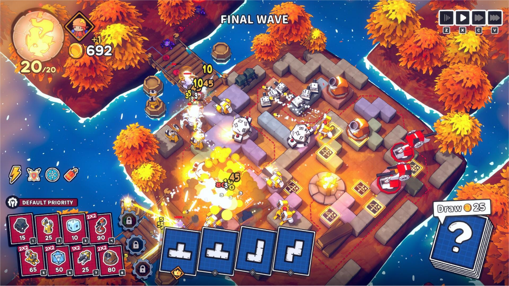
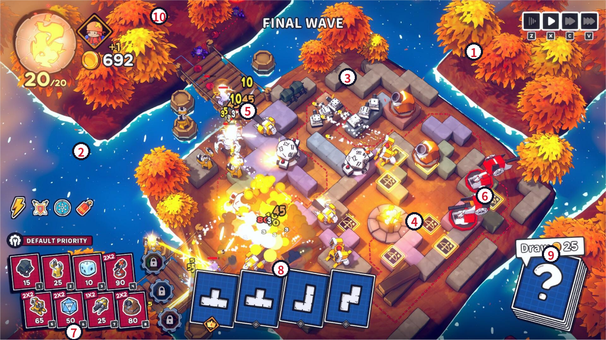
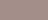
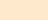
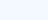
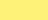

# 秋岛塔防（暂定名）· 游戏美术规范 Art Style Guide


引擎：团结引擎 Tuanjie 1.10.4（基于 Unity 2022 LTS）｜渲染管线：URP 14.x（Shader Graph）

版本：v1.0　｜　日期：2026-10-07　｜　适用对象：3D 美术、TA、特效、UI、客户端程序



*图 0  目标效果参考图*


---


# 文档使用说明

- 本文档是“能直接照着做”的执行规范：所有数值都是**起始值**，在目标镜头（第 6 章）下验收后再微调，调整结果需回写到本文档并升版本号。
- 颜色值一律为 **sRGB HEX**。项目 Color Space 必须为 **Linear**（Project Settings › Player › Other Settings），Shader Graph / Inspector 的拾色器会自动把 sRGB 转换为线性值，直接填 HEX 即可。
- 单位约定：1 Unity 单位 = 1 米 = **1 个棋盘格**。“px”指 1920×1080 参考分辨率下的像素。
- “PC / 移动”双列数值：PC 为主平台（参考图带键盘快捷键 Z/X/C/V），移动端或团结引擎小游戏平台按“移动”列执行。
- 章节目录：1 风格概述｜2 配色规范｜3 模型规范（含 3.8 树木与装饰物层次）｜4 材质与 Shader（含 4.6 粗描边）｜5 灯光与后处理｜6 镜头｜7 角色与单位｜8 特效｜9 武器与火种视觉规范｜10 UI｜11 性能预算与检查清单｜附录


---


# 1  风格概述


## 1.1  风格关键词

| 关键词 | 含义 | 落地要求 |
|---|---|---|
| 低多边形卡通 (Stylized Low-Poly) | 大块面、少细节，靠形体与色块表达 | 模型以“剪影+倒角”出效果，**不画写实贴图细节**；贴图以调色板/渐变为主 |
| 秋日暖橙 vs 深海冷蓝 | 画面最强对比来自橙红树冠与深蓝水面的冷暖对撞 | 暖色只用于树、特效、可交互高亮；冷色用于水面、UI 卡牌；中性紫灰承载棋盘 |
| 漂浮岛屿 / 桌面棋盘 | 岛屿是“放在水面上的玩具棋盘” | 岛屿边缘做明显厚度（0.6–1.0 m 土层侧壁），边缘有白色浪花圈 |
| 玩具感 / 手办感 | 材质像哑光塑料或上色黏土 | 低高光、无粗糙度细节；阶梯光照 + 柔和 AO + 轻微边缘光 |
| Q 版大头 | 角色 2–2.5 头身，夸张武器 | 剪影优先，64 px 高度时仍能辨认阵营与兵种 |
| 夸张反馈 | 爆炸、闪白、飘字、震屏一起出现 | 特效用 HDR 亮度触发 Bloom；飘字粗描边弹跳；有分级震屏 |
| 冬意点缀 | 秋景中飘雪 | 全屏稀疏飘雪粒子，不做积雪，不改变主色调 |


## 1.2  参考图分析



*图 1-1  参考图要素标注*

| 编号 | 要素 | 观察到的特征 | 对应规范章节 |
|---|---|---|---|
| ① | 漂浮岛屿 + 秋叶树 | 树冠为 3–6 个低模球团堆叠；颜色自下而上 暗红→橙→金黄；顶部受光面接近黄白 | 3.8 / 4.4 |
| ② | 深蓝水面 | 高饱和深蓝 #0754A0 为主，岛屿边缘和水面上有白色不规则浪纹；无明显反射 | 4.3 |
| ③ | 紫灰石块障碍 | 俄罗斯方块形状的石块，顶部浅紫 #C599C1/#AC95C5，侧面灰紫，带小倒角 | 2.2 / 3.3 |
| ④ | 棋盘地块 | 土红地面 #A4514C 上铺浅色可建造格，建造格带金色描边 + 图标贴花 | 2.2 / 3.3 |
| ⑤ | 爆炸 + 伤害飘字 | 黄白爆炸核心过曝触发 Bloom；数字为黄色/白色粗描边，多个数字叠加弹出 | 8.x |
| ⑥ | 敌方单位 | 红白配色机甲，红色 #D21C36 作为“敌方”专用色；与我方黄色清晰区分 | 7.2 / 4.6 |
| ⑦ | 单位卡牌（红） | 深玫红底卡、圆角、粗暗描边，左上角“2X2”占格标签，底部费用数字 | 10.3 |
| ⑧ | 拼图块卡牌（蓝） | 蓝图风格：深蓝底 + 浅蓝网格线 + 白色形状图标 | 10.3 |
| ⑨ | 抽牌堆 | 叠放 3 张的蓝图卡 + 白色问号，右上角气泡显示费用 | 10.3 |
| ⑩ | HUD | 左上基地血量圆盘、金币；顶部居中“FINAL WAVE”；右上倍速按钮带按键提示 | 10.4 |


## 1.3  画面层级（从亮到暗、从暖到冷）

1. **第一层 · 战斗焦点**：特效（HDR 亮度 2–8）、伤害数字、可交互高亮 —— 画面最亮、饱和度最高。
2. **第二层 · 单位与塔**：白/黄（我方）与红（敌方），亮度高于地面 15–25%。
3. **第三层 · 棋盘与障碍**：紫灰、土红、浅砂色，中等亮度、低饱和。
4. **第四层 · 环境框景**：橙红树冠（饱和但位于画面边缘），深蓝水面（最暗的大面积色块）。
5. **UI 层**：固定在屏幕四周，卡牌用蓝/红两种冷暖底色，所有 UI 有 3–4 px 深色描边，与 3D 画面分离。

> **验收口诀**：把截图转成灰度，单位必须比所在地面亮或暗至少 20%（灰度值差 ≥ 50/255）；把截图缩小到 25%，仍能一眼找到敌人和爆炸。


# 2  配色规范

色值取自参考图（中值切分取色后人工校正）。表中“色块”列为实际颜色。**新资产只能使用本表颜色或其 ±10% 明度变体**；需要新颜色时由主美加入本表。


## 2.1  主色（环境主体）

| 色块 | 名称 | HEX | RGB | 用途 |
|---|---|---|---|---|
|  | 秋叶橙（主色） | #E3713A | 227,113,58 | 树冠中段、木质受光面 |
|  | 枫叶红 | #BF4D37 | 191,77,55 | 树冠下段、阴影过渡 |
|  | 叶尖金 | #F0A352 | 240,163,82 | 树冠顶部受光 |
|  | 高光金黄 | #F5D27A | 245,210,122 | 树冠最亮点、边缘光 |
|  | 树影酒红 | #64273B | 100,39,59 | 树冠背光/阴影色 |
|  | 深海蓝（主色） | #0754A0 | 7,84,160 | 水面主体 |
|  | 深渊蓝 | #03357A | 3,53,122 | 深水、岛屿水下部分 |
|  | 浅水蓝 | #1C7CD0 | 28,124,208 | 岛屿周边浅水 |


## 2.2  辅助色（棋盘、障碍、建筑）

| 色块 | 名称 | HEX | RGB | 用途 |
|---|---|---|---|---|
|  | 土红地面 | #A4514C | 164,81,76 | 棋盘地面主色 |
|  | 土红暗部 | #874A4A | 135,74,74 | 地面侧壁、缝隙 |
|  | 砂岩浅色 | #F6D692 | 246,214,146 | 可建造格顶面 |
|  | 砖橙 | #E9A47B | 233,164,123 | 地砖、路径 |
|  | 石块淡紫 | #C599C1 | 197,153,193 | 石块顶面（暖紫） |
|  | 石块薰衣草 | #AC95C5 | 172,149,197 | 石块顶面（冷紫） |
|  | 石块灰褐 | #A38E89 | 163,142,137 | 石块侧面、灰岩 |
|  | 石块暗紫 | #503E5D | 80,62,93 | 石块阴影侧、缝隙 |
|  | 木桥深棕 | #6D3646 | 109,54,70 | 木桥、木桶暗部 |
|  | 原木色 | #B07A55 | 176,122,85 | 木桶、木板受光面 |


## 2.3  环境色（光照、阴影、氛围）

| 色块 | 名称 | HEX | 用途 / 填写位置 |
|---|---|---|---|
|  | 主光暖白 | #FFE9CC | Directional Light › Color |
|  | 天空环境色 | #9FB8E0 | Lighting › Environment › Gradient Sky Color |
|  | 地平环境色 | #8A7FA0 | Gradient Equator Color |
|  | 地面环境色 | #4A3A55 | Gradient Ground Color |
|  | 通用阴影色 | #6E5A8C | Toon Shader _ShadowColor（与 BaseColor 相乘） |
|  | 树冠阴影色 | #7A3050 | 树叶 Shader _ShadowColor |
|  | 浪花白 | #E6F0FF | 水面泡沫、浪纹 |
|  | 雪花白 | #F4F8FF | 飘雪粒子 |
|  | 暗角色 | #0A1A3A | Vignette › Color |


## 2.4  阵营、UI 与特效色

| 色块 | 名称 | HEX | 用途 |
|---|---|---|---|
|  | 我方黄 | #F2B330 | 我方单位头盔/护甲点缀、友方选中圈 |
|  | 机甲白 | #D9D4DA | 我方塔/机器人主体 |
|  | 敌方红（专用） | #D21C36 | 敌方单位主色、敌方血条、危险提示；**禁止用于我方** |
|  | 敌方暗色 | #3B1E2E | 敌方单位暗部、关节 |
|  | 卡牌蓝 | #1E519C | 拼图块卡牌底色 |
|  | 卡牌深蓝 | #152D5E | 蓝卡内框、按钮底 |
|  | 蓝图线 | #899DBF | 蓝卡网格线（Alpha 40%） |
|  | 卡牌玫红 | #AC1143 | 单位卡底色、标签底 |
|  | 卡牌暗红 | #4B0F30 | 红卡内框、阴影 |
|  | UI 描边色 | #1A1630 | 所有 UI 外描边、文字描边 |
|  | 金币金 | #FABE2C | 金币、费用图标、普通伤害数字 |
|  | 爆炸亮黄 | #FFF27A | 爆炸核心（HDR ×4–8） |
|  | 爆炸橙 | #FFB52E | 爆炸火焰中段 |
|  | 烟雾暗紫 | #5A2E3A | 爆炸烟雾末端 |
|  | 治疗绿 | #7CE86A | 治疗数字、增益 |
|  | 冰霜青 | #5FD0FF | 冰冻/护盾类效果 |


## 2.5  配色比例与禁忌

- 画面面积比例目标：**深蓝水面 30–35%｜橙红树冠 20–25%｜紫灰/土红棋盘 25–30%｜单位与特效 5–10%｜UI 10–15%**。
- 棋盘区域禁止使用饱和度 > 60% 的颜色（HSV 的 S），饱和色留给单位、特效和 UI。
- 阴影永远偏紫（色相 260°–320°），**不要用纯黑或中性灰做阴影**。
- 纯白 #FFFFFF 只用于：特效核心、UI 文字、蓝卡上的图形；3D 模型最亮不超过 #F0F0F0。
- 绿色仅用于治疗/增益反馈，场景中不出现大面积绿色植被（保持秋季主题）。


---


# 3  模型规范


## 3.1  尺度与网格单位

| 项目 | 规范 |
|---|---|
| 基础单位 | 1 Unity 单位 = 1 m = 1 个棋盘格（Grid Cell） |
| 棋盘格 | 1 × 1 m，地块厚度 0.25 m；可建造格比地面高 0.05 m |
| 标准棋盘 | 12 × 12 格（关卡可在 8×8 ~ 14×14 之间） |
| 岛屿侧壁 | 水面以上 0.6–1.0 m，水面以下延伸 1.5 m（被水面 Shader 的深度渐变吃掉） |
| 水面高度 | 世界 Y = 0；棋盘顶面 Y = 0.8 |
| 占格尺寸 | 1×1 资产占地 0.85×0.85 m（四周留 0.075 m 缝）；2×2 资产占地 1.85×1.85 m |
| 石块障碍 | 单块 1×1×0.6 m，俄罗斯方块组合，块间合并为一个网格（不留内部面） |
| 树木 | 小树高 1.2–1.8 m；大树高 2.5–3.5 m；树冠直径 = 高度 × 0.8 |
| 单位 | 我方步兵 0.8 m；敌方小兵 0.7–0.9 m；精英 1.2–1.4 m；Boss 2.0–2.5 m |
| DCC 设置 | Blender：Unit Scale 1.0、Metric、长度 m；Maya：cm 制作时导出 Scale Factor 0.01 / 勾选 Convert Units |


## 3.2  轴向、Pivot 与导出

- 正面朝 **+Z**，Y 轴向上。Blender 导出 FBX：Forward = -Z Forward、Up = Y Up、勾选 **Apply Transform**、Apply Scalings = FBX All。
- Pivot：地块/建筑/单位放在**底面中心**；门、炮塔等旋转件 Pivot 放在旋转轴心。
- 导出前：应用所有变换（Rotation 0、Scale 1）、清理空物体、合并同材质的静态部件、删除不可见面（贴地面底面、被遮挡的内部面）。
- 导入 Unity 后检查 Transform 为 (0,0,0)/(0,0,0)/(1,1,1)，Prefab 根节点下不得出现 -90° 的 X 旋转。


## 3.3  面数预算（三角面）

| 资产类别 | PC 预算 (tris) | 移动预算 (tris) | 材质数 | 备注 |
|---|---|---|---|---|
| 地面格 Tile 1×1 | 40–120 | ≤ 60 | 1（共享） | 只倒顶面四边，底面删除 |
| 可建造格 | 80–200 | ≤ 120 | 1（共享） | 图标用贴花四边形，不建模 |
| 石块障碍（每 1 格） | 80–250 | ≤ 150 | 1（共享） | 俄罗斯方块合并成一个 Mesh |
| 小道具（木桶/箱/灯） | 100–400 | ≤ 250 | 1（共享） | GPU Instancing |
| 木桥（每段） | 300–800 | ≤ 500 | 1 |  |
| 小树 | 300–700 | ≤ 400 | 1 | 树冠 3–4 个球团（每个 Icosphere 细分 1–2） |
| 大树 | 700–1500 | ≤ 800 | 1 | 树冠 4–6 个球团 + 树干 8 边形 |
| 岛屿块（每 4×4 m） | 1500–3000 | ≤ 1500 | 1–2 | 侧壁需有 3–5 层岩层凹凸 |
| 防御塔 1×1 | 1500–3000 | ≤ 1500 | ≤ 2 | 炮管/炮台拆分骨骼或子物体 |
| 防御塔 2×2 | 3000–5000 | ≤ 2500 | ≤ 2 |  |
| 我方单位 | 800–1500 | ≤ 800 | 1 | 含武器 |
| 敌方小兵 | 600–1200 | ≤ 600 | 1 |  |
| 敌方精英 | 1500–3000 | ≤ 1500 | 1–2 |  |
| Boss | 5000–8000 | ≤ 4000 | ≤ 3 |  |
| 特效网格（碎块/冲击环） | 12–200 | ≤ 100 | 共享 FX 材质 | 碎块使用 12 tris 的立方体/四面体 |

> **低多边形 ≠ 随意少面**：面应集中在剪影轮廓（树冠外轮廓、角色头部、炮管口），平坦区域尽量大面。在游戏镜头下检查：任意轮廓边在 1080p 下不应出现 > 8 px 的明显折线锯齿（树冠、圆顶等“圆形物”需要足够分段）。


## 3.4  倒角与法线

| 资产 | 倒角宽度 | 段数 | 法线处理 |
|---|---|---|---|
| 地块 / 石块 | 0.03–0.05 m（尺寸的 3–5%） | 1 | Weighted Normal（Face Area），硬边角度 30° |
| 建筑 / 防御塔 | 0.02–0.04 m | 1–2 | Weighted Normal；圆柱体侧面平滑、端面硬边 |
| 道具 | 0.015–0.03 m | 1 |  |
| 角色 / 单位 | 头盔/盔甲边缘 0.01–0.02 m | 1–2 | 整体平滑，仅装备边缘硬边 45° |
| 树冠 | 不倒角 | — | **平直着色（Flat）**以保留低模块面感；或 Auto Smooth 40° 获得柔化块面 |
| 岛屿侧壁 / 岩石 | 不倒角 | — | Flat 着色，体现岩层切面 |

- 倒角的目的是让边缘接住 Rim 光与高光，形成“手办感”亮边；**倒角宽度在游戏镜头下需 ≥ 1 px**，否则删除。
- 导入设置：Normals = **Import**，Tangents = Calculate Mikktspace（有法线贴图时）/ None（无法线贴图时，节省内存）。


## 3.5  UV 与贴图策略

- **环境资产统一使用调色板贴图**：T_Env_Palette_D（256×256，16×16 个色块，每块 16 px）。UV 岛缩小后放进对应色块中心，避免跨色块渗色（色块边缘留 2 px 同色出血）。
- 调色板分区：上 1/4 = 树冠渐变；第 2 行 = 石块/地面；第 3 行 = 木/金属；第 4 行 = 阵营色、发光色（发光色区配合 Emission Mask）。
- 角色/塔：单独 512×512（PC）/ 256×256（移动）手绘平涂贴图，只画色块和少量手绘高光，不画光影。
- 贴图导入：sRGB 开启；Filter Mode = Bilinear（调色板贴图用 Point 也可）；Generate Mip Maps：环境开、UI 关；压缩 PC = BC7，Android/iOS = ASTC 6×6（调色板用 ASTC 4×4 防止色块串色）。
- 禁止使用法线贴图（除 Boss 和特写道具外），卡通风格的细节由几何体和倒角提供。


## 3.6  顶点色通道约定

| 通道 | 含义 | 取值 | 用于 |
|---|---|---|---|
| R | 风动权重 | 树干 0，树枝 0.3，树冠外缘 1.0 | 树叶风动 Shader（4.4） |
| G | 烘焙 AO | 0 = 全遮蔽，1 = 无遮蔽；在 DCC 中烘焙后写入 | Toon Shader 环境光遮蔽（移动端替代 SSAO） |
| B | 色调变化 / 层级 | 道具：0–1 随机值；**树木：树冠层级 0 / 0.5 / 1（见 3.8.1）** | 道具明度随机 ±8%；树冠内外层调色 |
| A | 风动相位 | 每个树冠球团一个随机值 0–1 | 防止同屏树木同步摆动 |

- Blender 中使用 Color Attribute（Face Corner，Byte Color）。Blender 4.x 导出 FBX 时 Vertex Colors 选项选 **Linear**，保证数据值（如 0.5）原样进入引擎；Shader Graph 的 Vertex Color 节点读取原始值，不要再做 Gamma 转换。
- 未使用的通道统一填 1（白），避免 Shader 读到 0 导致全黑。


## 3.7  命名规范

格式：**前缀_类别_名称_变体_序号**，全部英文 PascalCase，禁止中文、空格与特殊字符。

| 前缀 | 资源类型 | 示例 |
|---|---|---|
| SM_ | 静态网格 (FBX) | SM_Env_Tree_Maple_A_01、SM_Env_Rock_TetrisL_01 |
| SK_ | 骨骼网格 | SK_Unit_Soldier_01、SK_Enemy_RedMech_Elite_01 |
| A_ | 动画片段 | A_Soldier_Attack_01、A_RedMech_Death |
| AC_ | Animator Controller | AC_Soldier |
| PF_ | 预制体 | PF_Tower_Cannon_1x1、PF_Tower_Laser_2x2 |
| M_ | 材质 | M_Env_Palette、M_Unit_Soldier、M_FX_Explosion_Add |
| SG_ | Shader Graph | SG_Toon_Lit、SG_Water_Stylized、SG_Foliage_Wind |
| SGS_ | Sub Graph | SGS_ToonLighting、SGS_MainLight |
| T_ | 贴图（后缀区分类型） | T_Env_Palette_D、T_Soldier_D、T_Ramp_Toon_3Step、T_FX_Smoke_4x4 |
| FX_ | 特效预制体 | FX_Explosion_Medium、FX_Hit_Spark、FX_Weather_Snow |
| UI_ | UI 精灵 | UI_Card_Frame_Blue、UI_Btn_Speed_x2 |
| ICN_ | 图标 | ICN_Unit_Cannon、ICN_Skill_Lightning |
| FNT_ | 字体资源（TMP） | FNT_Number_LilitaOne_SDF |
| VP_ | Volume Profile | VP_Battle_Default、VP_Battle_FinalWave |

贴图后缀：_D 颜色，_N 法线，_M 遮罩（R 金属/G AO/B 发光/A 平滑度），_E 发光，_R Ramp。LOD 后缀 _LOD0/_LOD1；碰撞体后缀 _COL。

目录结构：Assets/Art/{Environment, Units, Towers, FX, UI, Shaders, Materials, Textures, Animations}/<类别>/，Prefab 在 Assets/Prefabs/ 下按同样分类。


## 3.8  树木与装饰物的层次

参考图的环境丰富感来自“**树冠分层 + 景深分层 + 大中小道具疏密**”三个层次。以下规则对所有树木与装饰物强制执行。


### 3.8.1  多层树冠结构

| 层级 | 构成 | 体积占比 | 颜色（与 4.4 渐变叠加） | 顶点色 B | 作用 |
|---|---|---|---|---|---|
| L0 树干/枝 | 8 边形树干 + 2–3 根 4 边形主枝，伸入树冠内部 | — | #6D3646 → 受光 #B07A55 | 0 | 支撑剪影，树冠底部缝隙中可见 |
| L1 内核（暗层） | 1–2 个大球团（Icosphere 细分 1），缩在树冠中心偏下 | 40% | 明度 −25%，色相向酒红 #7A3050 偏 10° | 0.0 | 提供树冠内部的深色“洞”，制造体积 |
| L2 中层（主体） | 3–4 个中球团，围绕内核偏上排列，互相穿插 30% | 40% | 主色 #E3713A | 0.5 | 决定树冠的主轮廓 |
| L3 外层（亮层） | 3–6 个小球团/叶簇，位于顶部和朝光侧（左上） | 20% | 明度 +15%，色相向金 #F0A352 偏 10°，顶端 #F5D27A | 1.0 | 接受 Rim 与亮部，形成参考图中黄白色的顶部高光 |

- **层与层的尺寸比**：L1 : L2 : L3 单个球团直径 ≈ 1 : 0.7 : 0.4；外层球团至少有 50% 体积露在 L2 外面，否则删除。
- **不规则**：每个球团单独做 ±15% 非等比缩放和随机旋转；顶点做 0.03–0.05 m 随机位移（Blender Displace/Randomize），避免“完美球”。
- **树型变体**：每种树至少 A/B/C 三个变体（高瘦、圆胖、斜歪），场景中同一变体相邻摆放不超过 2 棵；摆放时再随机 Y 旋转 0–360°、整体缩放 0.85–1.15。
- **Shader 读取层级**：SG_Foliage_Wind 用顶点色 B 做层级调色：Color = BaseColor × Lerp(_InnerTint, _OuterTint, VertexColor.B)，_InnerTint = #B07090（暗、偏紫红），_OuterTint = #FFF0C8（亮、偏金）。外层风动权重（顶点色 R）= 1，中层 0.6，内核 0.3，使外层叶簇摆动更明显。
- **灌木/小植物** 使用相同的 3 层规则，但只做 L1 + L2（2 层），总高 0.3–0.6 m。


### 3.8.2  前景 / 中景 / 远景

镜头固定（第 6 章），所以景深层次在摆场景时就决定好。以默认机位的屏幕位置与到焦点距离划分：

| 景深层 | 位置 | 内容 | 明度 | 饱和度 | 色相偏移 | 实现方式 |
|---|---|---|---|---|---|---|
| 前景 | 屏幕下沿与左右下角，离镜头最近；**不得覆盖棋盘任何可交互格** | 被画面边缘裁切的大树冠、岩石边角 | −10% | +5% | 向红偏 5°（更暖更深） | 材质变体 M_Foliage_Near：_LeafBottom/Mid/Top 各降明度 10%；可选：顶点 Alpha 淡出避免挡 UI |
| 中景 | 棋盘本体及紧贴棋盘的岛屿边缘（参考图中棋盘四周的树） | 标准树、石块、道具、单位 | 基准 | 基准 | 基准 | M_Foliage（标准参数） |
| 远景 | 屏幕上沿的其他岛屿、棋盘外 10 m 以上 | 远处岛屿、成片树林剪影 | +8% | −20% | 混合 15% 的 #6A8CC8（冷蓝） | M_Foliage_Far + 线性雾（5.2：Start 45 / End 90）；远景树面数降到 200–400 tris、关闭投影与风动细抖 |

- **明暗递进**：前景最暗（剪影框景）→ 中景对比最强（游戏焦点）→ 远景最亮最灰（空气感）。灰度截图中三层的平均明度应能明显区分（差值 ≥ 15/255）。
- **色相递进**：前景暖红 → 中景橙 → 远景橙中带蓝灰。水面同理：靠近岛屿 #1C7CD0（浅） → 开阔水面 #0754A0 → 画面边缘 #03357A（由雾与 Vignette 共同完成）。
- **饱和度焦点**：画面饱和度最高点必须在中景棋盘（单位、特效），前景树饱和度可高但面积 ≤ 屏幕 12%。
- **框景构图**：至少两个对角（参考图为左上与右上/右下）有前景或中景树冠框住棋盘；屏幕中心 50% × 50% 区域内不得有前景物体。


### 3.8.3  装饰物尺寸分级与摆放密度

| 等级 | 尺寸 | 示例 | 密度（每 4×4 m 岛屿区域） | 间距规则 | 可放位置 |
|---|---|---|---|---|---|
| 大型 | > 1.5 m | 大树、巨石、塔楼残骸 | 0–2 个 | 彼此间距 ≥ 2.5 m；作为视觉锚点 | 岛屿边缘、棋盘外；**禁止放在棋盘可建造格上** |
| 中型 | 0.5–1.5 m | 小树、灌木丛、木桶堆、路灯、石墩 | 2–4 个 | 围绕大型物 1–2 m 呈半包围 | 岛屿边缘、桥头、棋盘外沿 1 格带 |
| 小型 | < 0.5 m | 石子、落叶堆、蘑菇、小草丛、碎木板 | 6–12 个 | 成簇摆放，每簇 3–5 个，簇间距 ≥ 1 m | 任意位置，含棋盘不可建造格的边角；不得遮挡可建造格图标 |

- **组团法则（1-3-5）**：1 个大型 + 3 个中型 + 5 个小型组成一个“景点”，大型在后（远离镜头一侧），小型在前，形成由高到低的阶梯轮廓。
- **疏密节奏**：岛屿边缘密（参考图树冠沿岸成片）、棋盘内部疏；同一岛屿至少留 30% 面积为“呼吸区”（只有地面与小型物）。
- **留白区**：棋盘可建造格和敌人行进路径（含路径两侧 0.3 m）只允许 ≤ 0.15 m 高的地面贴花类小装饰，保证单位与特效可读。
- **落叶点缀**：秋季主题，地面落叶贴花（Decal 或贴地面片）每 4×4 m 2–4 片，颜色取树冠三色随机，集中在树下 2 m 半径内。
- **摆放工具**：使用 Prefab Brush / Polybrush 随机散布，随机旋转 Y 0–360°、缩放 0.85–1.15；完成后合并为 Static 物体并在 Frame Debugger 确认合批。
- **数量上限**：每个关卡装饰物 ≤ 400 个实例（PC）/ ≤ 200 个（移动），其中投影的仅限大型与中型。


---


# 4  材质与 Shader（URP Shader Graph）


## 4.1  URP 资产与工程前置设置

| 设置位置 | 参数 | PC | 移动 / 小游戏 |
|---|---|---|---|
| Project Settings › Player | Color Space | Linear | Linear（小游戏若仅支持 WebGL1 则需评估 Gamma） |
| URP Asset › Rendering | Depth Texture | 开（水面需要） | 开 |
|  | Opaque Texture | 关（不做折射） | 关 |
| URP Asset › Quality | HDR | 开 | 开（Bloom 依赖；低端机关） |
|  | Anti Aliasing (MSAA) | 4x | 2x |
|  | Render Scale | 1.0 | 0.85–1.0 |
| URP Asset › Lighting | Main Light / Cast Shadows | Per Pixel / 开 | Per Pixel / 开 |
|  | Shadow Resolution | 2048 | 1024 |
|  | Additional Lights | Per Pixel，上限 4 | Disabled 或 Per Vertex |
| URP Asset › Shadows | Max Distance | 40 | 30 |
|  | Cascade Count | 2（Split 25%） | 1 |
|  | Depth Bias / Normal Bias | 1.0 / 0.6 | 1.0 / 0.8 |
|  | Soft Shadows | 开（Medium） | 关 |
| URP Renderer | Rendering Path | Forward（或 Forward+） | Forward |
|  | Depth Priming Mode | Auto | Disabled |
| URP Asset | SRP Batcher | 开 | 开 |


## 4.2  通用卡通 Shader：SG_Toon_Lit

**图形目标**：Shader Graph › Graph Settings › Target = Universal，Material = **Unlit**（光照完全自己算），Surface = Opaque，勾选 **Cast Shadows**（URP 14 的 Unlit 目标在 Graph Settings 中提供该选项；导入后用 Frame Debugger 确认模型出现在 MainLightShadow 阶段的绘制列表中）。所有参数暴露在 Blackboard 中，命名以下划线开头以兼容 SRP Batcher。


### 4.2.1  Blackboard 关键字（接收实时阴影 / SSAO 必需）

| Keyword 名称 (Reference) | Type | Definition | Scope |
|---|---|---|---|
| _MAIN_LIGHT_SHADOWS | Boolean | Multi Compile | Global |
| _MAIN_LIGHT_SHADOWS_CASCADE | Boolean | Multi Compile | Global |
| _SHADOWS_SOFT | Boolean | Multi Compile | Global |
| _SCREEN_SPACE_OCCLUSION | Boolean | Multi Compile | Global |


### 4.2.2  主光源 Custom Function（文件：Assets/Art/Shaders/Include/ToonLighting.hlsl）

```
// Custom Function 节点：Type = File，Name = MainLight（精度后缀 _float 由 SG 自动匹配）
void MainLight_float(float3 WorldPos, out float3 Direction, out float3 Color,
                     out float ShadowAtten)
{
#if defined(SHADERGRAPH_PREVIEW)
    Direction = normalize(float3(0.5, 0.6, -0.4));
    Color = float3(1, 1, 1);
    ShadowAtten = 1;
#else
    float4 shadowCoord = TransformWorldToShadowCoord(WorldPos);
    Light mainLight = GetMainLight(shadowCoord);
    Direction   = mainLight.direction;
    Color       = mainLight.color;
    ShadowAtten = mainLight.shadowAttenuation;
#endif
}

// 屏幕空间 AO（URP SSAO Renderer Feature 开启时生效）
void SSAO_float(float2 ScreenUV, out float AO)
{
#if defined(_SCREEN_SPACE_OCCLUSION) && !defined(SHADERGRAPH_PREVIEW)
    AmbientOcclusionFactor f = GetScreenSpaceAmbientOcclusion(ScreenUV);
    AO = f.indirectAmbientOcclusion;
#else
    AO = 1;
#endif
}
```


### 4.2.3  节点流程（阶梯光照 + Ramp + 阴影色 + Rim）

1. **光照项**：Normal Vector(World) 与 MainLight.Direction 做 Dot Product → NdotL。Half Lambert：NdotL × 0.5 + 0.5。
2. **阴影合成**：LightTerm = HalfLambert × lerp(1, ShadowAtten, _ShadowStrength)。（实时阴影与自阴影统一走 Ramp，阴影边缘同样被“卡通化”。）
3. **阶梯化（二选一）**：A. Ramp 贴图：Sample Texture 2D(_RampTex, UV = (LightTerm, 0.5))，取 R 通道；Sampler State：Clamp + Bilinear。B. 程序化：Smoothstep(_ShadowThreshold − _ShadowSmooth, _ShadowThreshold + _ShadowSmooth, LightTerm)。默认用 A（美术可换 Ramp 改风格），移动端低配用 B（少一次采样）。
4. **阴影上色**：Diffuse = BaseColor × Lerp(_ShadowColor, _LitColor, Ramp) × MainLight.Color。阴影不是“变暗”，而是“乘紫色”。
5. **环境光**：Ambient = BaseColor × SampleSH(Normal)（Baked GI 节点或 Ambient 节点的 Sky/Equator/Ground 按法线 Y 插值）× _AmbientStrength × AO，其中 AO = 顶点色 G × SSAO。
6. **Rim 边缘光**：Fresnel = 1 − Saturate(Dot(N, ViewDir))；Rim = Smoothstep(_RimMin, _RimMax, Fresnel) × Saturate(NdotL + _RimLitBias) × _RimColor × _RimIntensity。乘以 NdotL 项使 Rim 只出现在受光侧，背光面不发亮。
7. **风格化高光（可选，金属件/头盔）**：H = Normalize(L + V)；Spec = Step(_SpecThreshold, Dot(N, H)) × _SpecIntensity × 遮罩贴图 R。
8. **受击闪白**：Final = Lerp(Diffuse + Ambient + Rim + Spec + Emission, _FlashColor, _HitFlash)。_HitFlash 由脚本用 MaterialPropertyBlock 驱动（注意：MPB 会打断 SRP Batcher，仅在闪白的 0.1 s 内设置，结束后 Clear）。
9. 输出到 Fragment › Base Color；Alpha = 1。


*图 4-1  T_Ramp_Toon_3Step（256×8，三阶：暗部 0 / 中间调 0.6 / 亮部 1.0）——已随文档提供 PNG*

Ramp 贴图导入设置：Texture Type = Default，**sRGB 关闭**，Wrap = Clamp，Filter = Bilinear，Mip Maps 关闭，压缩 = None（或 R8）。


### 4.2.4  参数建议

| 参数 | 类型 | 默认值 | 范围 | 说明 |
|---|---|---|---|---|
| _BaseMap / _BaseColor | Texture2D / Color | 调色板 / #FFFFFF | — | 基础色 |
| _RampTex | Texture2D | T_Ramp_Toon_3Step | — | 可换 2 阶（更硬）或 4 阶 Ramp |
| _ShadowThreshold | Float | 0.45 | 0.3–0.6 | 程序化阶梯的阴影分界 |
| _ShadowSmooth | Float | 0.03 | 0.005–0.1 | 明暗交界宽度；角色 0.04，场景 0.02 |
| _ShadowStrength | Float | 0.85 | 0–1 | 实时投影浓度 |
| _ShadowColor | Color | #6E5A8C | — | 树叶用 #7A3050，水下岩石用 #3A3F7A |
| _LitColor | Color | #FFFFFF | — | 亮部色，可设 #FFF6EA 微暖 |
| _AmbientStrength | Float | 0.35 | 0.2–0.6 | 环境光强度 |
| _RimColor | Color | #FFE6C7 | — | 暖色边缘光 |
| _RimMin / _RimMax | Float | 0.55 / 0.75 | — | Rim 宽度；角色 0.5/0.7（更宽） |
| _RimIntensity | Float | 0.35 | 0–1 | 场景 0.25，角色 0.45 |
| _RimLitBias | Float | 0.3 | 0–1 | 允许 Rim 延伸到暗部的程度 |
| _SpecThreshold | Float | 0.96 | 0.9–0.99 | 高光点大小 |
| _SpecIntensity | Float | 0.4 | 0–1 | 只用于金属/头盔 |
| _EmissionColor | Color HDR | 黑 | 强度 0–4 | 灯、能量核心 |
| _HitFlash | Float | 0 | 0–1 | 脚本驱动 |
| _FlashColor | Color | #FFFFFF | — | 冰冻时改 #5FD0FF |


### 4.2.5  描边

角色、单位、防御塔使用粗描边，完整实现方案与参数见 **4.6**。环境资产不描边，靠倒角 + Rim 区分。


## 4.3  水面 Shader：SG_Water_Stylized

Graph Settings：Unlit，Surface = **Transparent**，Blend = Alpha，Depth Write = Off，Render Queue = 2950（在其他透明物体之前）。水面网格：覆盖整个可视区的平面，细分 64×64（用于顶点波），放在 Y = 0。

1. **深度差**：Scene Depth（Mode = Eye）− Screen Position（Mode = Raw）的 W 分量 → DepthDiff（水面到水底的视线距离）。
2. **深浅色**：DepthFade = Saturate(DepthDiff / _DepthDistance)；WaterColor = Lerp(_ShallowColor, _DeepColor, DepthFade)；Alpha = Lerp(_ShallowAlpha, 1, DepthFade)。岛屿水下部分因此自然被染成深蓝。
3. **岸边泡沫圈**：FoamMask = 1 − Saturate(DepthDiff / _FoamDistance)；FoamNoise = Gradient Noise(UV = WorldPos.xz × _FoamNoiseScale + Time × _FoamSpeed)；Foam = Step(FoamNoise, FoamMask × _FoamCutoff)。用 Step 而不是柔和过渡，得到参考图中硬边的白色浪圈。
4. **水面浪纹（白色条纹）**：Voronoi(UV = WorldPos.xz × _WaveScale, AngleOffset = Time × _WaveSpeed) → Power(_WavePower) → Step(_WaveCutoff) × _WaveAlpha。再叠一层不同比例和方向的 Voronoi 做 Max，形成参考图中的不规则白色浪线。
5. **Fresnel 提亮**：Fresnel Effect(Power = 3) × _FresnelColor 叠加到 WaterColor，远处水面略亮。
6. **顶点波**：Position.y += Sin(Time × _WaveFreqT + WorldPos.x × 0.8 + WorldPos.z × 0.6) × _VertexWaveAmp。
7. **最终**：Color = Lerp(WaterColor + Fresnel, _FoamColor, Saturate(Foam + Waves))；Alpha = Max(Alpha, Foam)。
8. **接收阴影（可选）**：调用 MainLight Custom Function，Color × Lerp(0.75, 1, ShadowAtten)，让岛屿和树的投影落在水面上（参考图左侧可见）。

| 参数 | 默认值 | 说明 |
|---|---|---|
| _ShallowColor | #1C7CD0 | 岸边浅水 |
| _DeepColor | #03357A | 深水；主体可见色约等于 #0754A0 |
| _DepthDistance | 2.5 | 深浅过渡距离（m） |
| _ShallowAlpha | 0.65 | 岸边透明度 |
| _FoamColor | #E6F0FF | 泡沫/浪纹颜色 |
| _FoamDistance | 0.35 | 岸边泡沫宽度（m） |
| _FoamCutoff | 1.2 | >1 时泡沫更连续 |
| _FoamNoiseScale / _FoamSpeed | 6 / (0.05, 0.03) | 噪声缩放 / 流动速度 |
| _WaveScale / _WaveSpeed | 0.6 / 0.8 | 浪纹大小 / Voronoi 动画速度 |
| _WavePower / _WaveCutoff | 3 / 0.55 | 浪纹细线化 |
| _WaveAlpha | 0.45 | 浪纹不透明度 |
| _FresnelColor | #3A8AD8 × 0.3 | 掠射角提亮 |
| _VertexWaveAmp / _WaveFreqT | 0.03 / 1.2 | 顶点起伏（固定镜头，幅度保持很小） |


## 4.4  树叶风动 Shader：SG_Foliage_Wind

在 SG_Toon_Lit 基础上复制，增加顶点偏移、高度渐变色与树冠分层调色（顶点色 B，见 3.8.1）。Graph Settings 勾选 **Alpha Clipping = 关**（低模实体树冠，不用面片）；材质勾选 **Enable GPU Instancing**。

1. **世界相位**：Phase = Dot(WorldPos(Object 原点, 用 Object 节点的 Position), _WindDirection) × _WindFrequency + VertexColor.A × 6.283。
2. **主摆动**：Sway = Sin(Time × _WindSpeed + Phase) × _WindStrength。
3. **细碎抖动**：Flutter = (Gradient Noise(WorldPos.xz × 2 + Time × _FlutterSpeed) − 0.5) × _FlutterStrength。
4. **权重**：Weight = VertexColor.R × Saturate(Position(Object).y / _TreeHeight)（树根不动、越高越摆）。
5. **偏移**：Offset(World) = _WindDirection × (Sway + Flutter) × Weight；Transform 节点 World → Object（Direction 模式）后加到 Position(Object)，连 Vertex › Position。
6. **高度渐变色**：t = Saturate((Position(Object).y − _GradientMin) / (_GradientMax − _GradientMin))；BaseColor = 三色 Lerp：_LeafBottom → _LeafMid（t=0.5）→ _LeafTop，再进入卡通光照。顶点色 B 做 ±8% 明度随机。
7. **树冠阴影色** 使用 #7A3050，Rim 强度提到 0.45，使树冠受光边缘出现参考图中的黄白亮边。

| 参数 | 默认值 | 说明 |
|---|---|---|
| _WindDirection | (0.8, 0, 0.6) | 世界空间风向（归一化） |
| _WindStrength | 0.05 | 主摆幅（m）；大风关卡 0.12 |
| _WindSpeed | 1.6 | 主摆速度 |
| _WindFrequency | 0.35 | 空间频率，越大相邻树相位差越大 |
| _FlutterStrength / _FlutterSpeed | 0.015 / 6 | 叶片细抖 |
| _TreeHeight | 3.0 | 权重归一化高度（随树高调整） |
| _LeafBottom / _LeafMid / _LeafTop | #A8322F / #E3713A / #F5C25A | 自下而上渐变 |
| _GradientMin / _GradientMax | 0.8 / 3.2 | 渐变的物体空间高度范围 |


## 4.5  其他材质

| 材质 | Shader | 要点 |
|---|---|---|
| M_Env_Palette（地块/石块/道具） | SG_Toon_Lit | 调色板贴图；_RimIntensity 0.25；全部场景静态物共用一个材质 → SRP Batcher 合批 |
| M_Env_Island_Cliff | SG_Toon_Lit + 水下渐变 | 增加 _UnderwaterFade：WorldPos.y < 0 时 Lerp 到 #03357A，过渡 1.2 m |
| M_Env_Tile_Buildable | SG_Toon_Lit + Emission | 可建造格图标区发光 #FFD36A × 1.2；悬停时脚本把 _HoverGlow 0→1（0.15 s） |
| M_Unit_* | SH_Toon_Unit（双 Pass HLSL，见 4.6） | 描边 + 闪白；Rim 0.45 |
| M_Decal_Range | URP Decal Projector | 攻击范围圈：虚线圆 #FFFFFF α0.6，敌方 #D21C36；需在 Renderer 中添加 Decal Feature（Technique = Screen Space） |
| M_Shadow_Blob（移动低配） | Unlit Transparent | 关闭实时阴影时给单位脚下放圆形假阴影，颜色 #2A1A33 α0.45 |


## 4.6  角色与单位粗描边（URP 实现）

适用：我方单位、敌方单位、防御塔、Boss、可拾取物。环境（地块、石块、树）**不描边**。目标是参考图式的“手办粗线”：在 1080p 下单位 3 px、塔 4 px、Boss 5 px，且镜头缩放时**屏幕宽度保持不变**。


### 4.6.1  方案选择

| 方案 | 做法 | 优点 | 缺点 | 用途 |
|---|---|---|---|---|
| A. 双 Pass Shader（推荐，常态描边） | 手写 HLSL Shader：Pass 1 `LightMode = UniversalForward`（卡通光照，可由 Shader Graph 生成代码后粘贴，或直接手写）；Pass 2 `LightMode = SRPDefaultUnlit`（URP 会在同一物体上额外绘制此 Pass）做法线外扩 + `Cull Front` | 每个材质可有不同描边色/宽度；两个 Pass 共用同一 CBUFFER，保持 SRP Batcher 兼容；无需额外材质槽 | Shader Graph 不能直接做多 Pass，需要手写/维护 HLSL | 所有单位、塔、Boss |
| B. 第二材质槽 | MeshRenderer 材质数组加第二个材质 M_Outline（SG_Toon_Outline：Unlit，Render Face = Back） | 纯 Shader Graph 可实现 | 子网格多时每个子网格都要配；DrawCall ×2；多材质易被误删 | 临时原型、美术快速验证 |
| C. Renderer Feature（Render Objects） | URP Renderer › Add Renderer Feature › Render Objects：Event = AfterRenderingOpaques，Layer Mask = Outline_Ally / Outline_Enemy 各一个 Feature，Override Material = M_Outline_Ally / M_Outline_Enemy，Override Mode = Material | 全局开关、按 Layer 批量控制、不改 Prefab 材质 | Override 材质拿不到物体自身贴图/参数，颜色只能按 Layer 区分 | 选中高亮、敌方目标锁定、低配统一关闭 |

**规范**：常态描边用方案 A；选中/悬停高亮用方案 C（把物体临时切到 Outline_Selected 层，覆盖为 #FFE45C 粗描边）；方案 B 只允许出现在原型阶段。


### 4.6.2  平滑法线烘焙

- 问题：硬边（倒角、盔甲棱角）处一个位置有多个法线，直接沿法线外扩会使描边**断裂**。必须外扩方向用“同位置顶点的平均法线”。
- 存储位置：**UV3（TEXCOORD3，xyz）存切线空间平滑法线**。不用物体空间：骨骼蒙皮不会变形 UV 数据，物体空间法线在动画中会错；切线空间法线在 Shader 中用蒙皮后的 TBN 还原即可正确跟随动画。
- 备选：单位不使用 3.6 的环境顶点色约定时，可写入顶点色 RGB（值映射 n×0.5+0.5），A 通道存描边宽度系数（眼睛/手指 0.3，正常 1.0）。二选一，全项目统一，**默认 UV3**；宽度系数存 UV3.w。
- 导入时自动烘焙：AssetPostprocessor 对 Assets/Art/Units/ 与 Assets/Art/Towers/ 下的模型执行，美术不需手动操作。

```csharp
// Editor/SmoothNormalBaker.cs（摘要）
class SmoothNormalBaker : AssetPostprocessor {
  void OnPostprocessModel(GameObject go) {
    if (!assetPath.Contains("/Units/") && !assetPath.Contains("/Towers/")) return;
    foreach (var m in go.GetComponentsInChildren<MeshFilter>().Select(f => f.sharedMesh)
                     .Concat(go.GetComponentsInChildren<SkinnedMeshRenderer>().Select(s => s.sharedMesh)))
      Bake(m);
  }
  static void Bake(Mesh m) {
    var v = m.vertices; var n = m.normals; var t = m.tangents;
    var avg = new Dictionary<Vector3, Vector3>();
    for (int i = 0; i < v.Length; i++) {           // 同位置法线累加（按角度加权更佳）
      avg.TryGetValue(v[i], out var s); avg[v[i]] = s + n[i]; }
    var uv3 = new List<Vector4>(v.Length);
    for (int i = 0; i < v.Length; i++) {
      Vector3 sn = avg[v[i]].normalized;
      Vector3 T = t[i]; Vector3 N = n[i]; Vector3 B = Vector3.Cross(N, T) * t[i].w;
      uv3.Add(new Vector4(Vector3.Dot(sn, T), Vector3.Dot(sn, B), Vector3.Dot(sn, N), 1f)); // w=宽度系数
    }
    m.SetUVs(3, uv3);
  }
}
// 前提：FBX 导入 Tangents = Calculate Mikktspace（描边单位不可选 None）
```


### 4.6.3  描边 Pass（屏幕空间恒定宽度）

```hlsl
Pass {
  Name "Outline"
  Tags { "LightMode" = "SRPDefaultUnlit" }
  Cull Front  ZWrite On  ZTest LEqual
  HLSLPROGRAM
  #pragma vertex vert
  #pragma fragment frag
  #include "Packages/com.unity.render-pipelines.universal/ShaderLibrary/Core.hlsl"
  // CBUFFER_START(UnityPerMaterial) 必须与 Forward Pass 完全一致（SRP Batcher）
  struct A { float4 pos:POSITION; float3 n:NORMAL; float4 t:TANGENT; float4 uv3:TEXCOORD3; };
  struct V { float4 pos:SV_POSITION; float fog:TEXCOORD0; };
  V vert(A i) {
    V o;
    float3 nWS = TransformObjectToWorldNormal(i.n);
    float3 tWS = TransformObjectToWorldDir(i.t.xyz);
    float3 bWS = cross(nWS, tWS) * i.t.w;
    float3 smoothWS = normalize(i.uv3.x * tWS + i.uv3.y * bWS + i.uv3.z * nWS);
    float4 posCS = TransformWorldToHClip(TransformObjectToWorld(i.pos.xyz));
    float3 nCS = mul((float3x3)GetWorldToHClipMatrix(), smoothWS);
    float2 dir = normalize(nCS.xy);
    dir.x *= _ScreenParams.y / _ScreenParams.x;               // 纵横比修正
    float px = _OutlineWidthPx * i.uv3.w * _OutlineGlobalScale;
    posCS.xy += dir * px * 2.0 / _ScreenParams.y * posCS.w;   // ×w => 屏幕像素恒定
    posCS.z  -= _OutlineZOffset * posCS.w;                    // 向后推，避免刺穿模型（DX 反向 Z 时取反）
    o.pos = posCS; return o;
  }
  half4 frag(V i) : SV_Target { return half4(_OutlineColor.rgb, 1); }
  ENDHLSL
}
```

- **随距离保持**：上式乘 posCS.w 后，描边在任何距离都是 _OutlineWidthPx 像素。为避免镜头拉远时细小单位被描边“吃掉”，脚本按镜头距离写全局参数 `_OutlineGlobalScale = Remap(CameraDistance, 22→40, 1.0→0.8)`（Shader.SetGlobalFloat，每帧一次）。
- **分辨率适配**：_OutlineWidthPx 以 1080p 为基准，脚本在分辨率变化时设置 `_OutlineGlobalScale *= Screen.height / 1080`，4K 下线宽翻倍，720p 下 ×0.67（最小不低于 1.5 px）。
- **死亡/溶解**：描边 Pass 同样读取 _Dissolve 并 clip，避免模型消失后留下“描边空壳”。
- **方案 B/C 的 Shader Graph 版**：Vertex 阶段在 Position(Object) 上加 `SmoothNormal(OS) × _OutlineWidth × 距离(Object→Camera) × 0.0015`（Shader Graph 中难以直接改裁剪空间，用距离补偿近似恒定像素）。


### 4.6.4  描边参数

| 对象 | _OutlineWidthPx（1080p） | _OutlineColor | _OutlineZOffset | 备注 |
|---|---|---|---|---|
| 我方单位 | 3 | #1E1A3A（深靛紫） | 0.0004 |  |
| 敌方单位 | 3 | #3B0E1E（深酒红） | 0.0004 | 敌我描边色不同，增强阵营识别 |
| 防御塔 1×1 / 2×2 | 4 / 4.5 | #1E1A3A | 0.0006 |  |
| 精英 / Boss | 4 / 5 | 敌方 #3B0E1E | 0.0008 | Boss 可在 Rage 阶段描边 HDR #FF3B3B ×1.5 |
| 中立物 / 拾取物 | 2.5 | #2A1A33 | 0.0004 |  |
| 选中（方案 C） | 5 | #FFE45C | 0.0008 | 覆盖常态描边 |
| 被锁定的敌方目标（方案 C） | 5 | #FF3B3B | 0.0008 |  |
| 冰冻状态 | 不变 | #1B4E7A | — | 由状态脚本切换颜色 |

- **颜色规则**：描边不用纯黑；取所属阵营暗色（明度 15–25%，饱和度 40–60%），色相与物体主色同族或偏紫。描边色明度必须低于物体最暗面至少 30%。
- **宽度规则**：同屏大小越大的单位描边越粗，但不超过 5 px；细部（眼睛、手指、天线）用 UV3.w = 0.3–0.5 降低，避免糊成一团。
- **性能**：描边 Pass 让单位 DrawCall ×2；同屏 > 60 单位时（见 7.5）远处单位关闭描边（`_OutlineWidthPx = 0` 并通过 Shader Feature 关闭 Pass）。移动低配全局关闭方案 C。


---


# 5  灯光与后处理


## 5.1  主光源（Directional Light）

| 参数 | 数值 | 说明 |
|---|---|---|
| Rotation | X = 50°，Y = −35°，Z = 0 | 光从左上后方照来（与镜头 Yaw 30° 配合），阴影投向右下，与参考图一致 |
| Color | #FFE9CC | 暖白，色温约 5200K |
| Intensity | 1.6 | URP 非物理单位；配合 Toon Ramp 时亮部 BaseColor 不应过曝 |
| Mode | Realtime | 单位与特效移动，需实时阴影 |
| Shadow Type | Soft Shadows（移动：Hard） |  |
| Shadow Strength | 0.75 | Toon Shader 中再乘 _ShadowStrength |
| Bias | Use Settings From Pipeline Asset | 异常时：Depth 1.0，Normal 0.6 |
| Culling Mask | Everything 除 UI、FX | 特效不投射阴影 |


## 5.2  环境光与雾

| Lighting 窗口参数 | 数值 |
|---|---|
| Environment › Skybox Material | None（摄像机 Background = Solid Color #03357A） |
| Environment Lighting › Source | Gradient |
| Sky / Equator / Ground Color | #9FB8E0 / #8A7FA0 / #4A3A55 |
| Environment Reflections | Source = Custom，Cubemap = None，Intensity = 0（卡通风格不要环境反射） |
| Fog | 开，Mode = Linear，Color #0A3A80，Start 45，End 90（仅影响远处海面边缘） |
| Baked GI / Realtime GI | 全部关闭（场景小，靠 Gradient + 顶点 AO 即可） |


## 5.3  辅助光

- **不放补光**。暗部亮度由 _ShadowColor 和环境光控制，避免多光源打断风格与性能。
- 爆炸闪光：可选用一盏 Point Light（Range 4，Intensity 0→3→0，持续 0.15 s，Color #FFB52E），**同屏最多 2 盏**，移动端禁用（改用地面贴花闪光）。


## 5.4  后处理（Global Volume：VP_Battle_Default）

Camera › Rendering › Post Processing 勾选；Anti-aliasing 若已开 MSAA 则选 None，否则选 SMAA（Medium）。Volume 放在场景根节点 Global Volume 上，Priority 0；“最终波次”用 VP_Battle_FinalWave（Priority 10，Weight 0→1 渐变 1.5 s）覆盖少数参数。

| 效果 | 参数 | PC 数值 | 移动 数值 |
|---|---|---|---|
| SSAO（Renderer Feature） | Method | Interleaved Gradient | 关闭（使用顶点色 G 烘焙 AO） |
|  | Intensity / Direct Lighting Strength | 0.6 / 0.25 |  |
|  | Radius / Falloff Distance | 0.3 / 50 |  |
|  | Source / Normal Quality | Depth Normals / Medium（若自定义 Shader 物体上 AO 异常，改为 Depth） |  |
|  | Downsample / After Opaque | 开 / 关 |  |
|  | Blur Quality / Samples | Medium / Medium |  |
| Bloom | Threshold | 1.0（只让 HDR > 1 的特效发光） | 1.0 |
|  | Intensity | 0.6 | 0.5 |
|  | Scatter | 0.65 | 0.6 |
|  | Tint | #FFE2B0 | #FFE2B0 |
|  | Clamp | 65472（默认） | 65472 |
|  | High Quality Filtering / Downscale | 关 / Half | 关 / Quarter |
|  | Max Iterations | 6 | 4 |
| Tonemapping | Mode | Neutral（ACES 会压暗橙色并降饱和，不用） | Neutral |
| Color Adjustments | Post Exposure | 0.1 | 0.1 |
|  | Contrast | 12 | 10 |
|  | Color Filter | #FFF6EC | #FFF6EC |
|  | Hue Shift | 0 | 0 |
|  | Saturation | 15 | 15 |
| White Balance | Temperature / Tint | 8 / 0 | 8 / 0（可烘进 LUT） |
| Split Toning | Shadows / Highlights / Balance | #3A3F8C / #FFC88A / −20 | 关 |
| Vignette | Color | #0A1A3A | #0A1A3A |
|  | Center | (0.5, 0.5) | (0.5, 0.5) |
|  | Intensity | 0.22 | 0.2 |
|  | Smoothness | 0.4 | 0.4 |
|  | Rounded | 关 | 关 |
| Depth Of Field | — | 关闭（俯视战术画面需全清晰） | 关闭 |
| Chromatic Aberration / Film Grain / Motion Blur | — | 关闭 | 关闭 |

**VP_Battle_FinalWave 覆盖项**：Vignette Intensity 0.32、Color #3A0A1A；Color Adjustments Saturation 20、Contrast 15；Bloom Intensity 0.75。

> **性能提示**：移动端将 White Balance、Color Adjustments、Split Toning 通过 URP 的 Color Grading Mode = Low Dynamic Range 合并为一张 LUT（LUT Size 32），只保留 Bloom + Vignette + Tonemapping 实时计算。


## 5.5  灯光验收标准

- 灰度截图中：棋盘顶面亮部 ≈ 170–200/255；石块暗面 ≈ 70–100；水面 ≈ 60–80；单位亮部 ≥ 200。
- 任何 3D 物体（非特效）在 Bloom 开启后不应发光：用 Frame Debugger 查看 Bloom Prefilter 贴图，场景物体应全黑。
- 阴影边缘为清晰卡通边（交界宽度 ≤ 3 px），阴影色可辨认为紫色而非灰黑。


---


# 6  镜头


## 6.1  基础参数

| 参数 | 数值 | 说明 |
|---|---|---|
| Projection | Perspective | 轻微透视让石块侧面可见，比正交更有“玩具棋盘”纵深 |
| Field of View (Vertical) | 28° | 窄 FOV 近似等轴视角，减少画面边缘拉伸；可在 24–34° 之间缩放 |
| 俯仰角 Pitch（Rotation X） | 50° | 参考图约 45–55°；保证能看到石块侧面与单位正面 |
| 偏航角 Yaw（Rotation Y） | 30° | 棋盘斜放，形成对角线构图（参考图棋盘约旋转 25–35°） |
| 相机到焦点距离 | 32 m（缩放 22–40 m） | 12×12 棋盘在 16:9 下占画面宽度约 55–60% |
| Clipping Planes | Near 1，Far 120 | 近裁面不要用 0.01，保持深度精度（水面依赖深度） |
| Background | Solid Color #03357A | 超出水面网格时不穿帮 |
| Post Processing / Anti-aliasing | 开 / 见 5.4 |  |
| 安全区 | 棋盘焦点放在屏幕中心偏上 5% | 下方留给卡牌 UI（屏幕下 25%） |

**Cinemachine 版本**：Package Manager 安装 **com.unity.cinemachine 2.10.x**（适配 2022 LTS）。若团结包管理器提供的是 3.x，组件对应关系：CinemachineVirtualCamera → CinemachineCamera；Framing Transposer → Position Composer；CinemachineConfiner → CinemachineConfiner3D；Impulse 组件名称不变。


## 6.2  Cinemachine 搭建（2.10.x）

1. Main Camera 挂 **CinemachineBrain**：Update Method = Late Update，Blend Update Method = Late Update，Default Blend = Ease In Out 0.6 s。
2. 创建空物体 **CameraRig**（放在棋盘中心，Y = 0.8），由输入脚本移动（拖拽平移 / WASD / 边缘滚动）。
3. 创建 **CM_vcam_Battle**：Priority 10；Transform Rotation = (50, 30, 0)；Follow = CameraRig；Look At = 空。
4. Body = **Framing Transposer**：Camera Distance 32；Dead Zone Width/Height 0；Soft Zone 0.8；X/Y/Z Damping = 0.4 / 0.4 / 0.6；Lookahead Time 0。
5. Aim = **Do Nothing**（角度固定，由 vcam 的 Transform 决定）。Lens：Vertical FOV 28，Near 1，Far 120。
6. Add Extension › **CinemachineConfiner**：Confine Mode = Confine 3D，Bounding Volume = 一个 BoxCollider（Is Trigger，尺寸 = 棋盘 + 每边 3 m 余量），Damping 0.3。
7. Add Extension › **CinemachineImpulseListener**：Channel Mask = Everything，Gain = 1（绑定设置中的“震屏强度 0–100%”），Use 2D Distance = 开，Reaction Settings 留空。
8. 缩放：滚轮 / 双指修改 FramingTransposer.m_CameraDistance，范围 22–40，SmoothDamp 时间 0.15 s；距离 < 26 时 FOV 同步从 28 线性降到 26，减少近景透视畸变。
9. 其他机位：CM_vcam_Intro（关卡开场，Dolly Track 环绕岛屿 4 s，Priority 0→20→0）；CM_vcam_BossFocus（Boss 登场，Follow = Boss，Camera Distance 20，Priority 20，持续 2 s，Blend 0.8 s）。


## 6.3  震屏（Cinemachine Impulse）

每类事件一个 CinemachineImpulseSource（放在特效 Prefab 或全局 ShakeManager 上），Impulse Type = **Dissipating**，Dissipation Distance 30，Default Velocity = (0, −1, 0)（以竖直方向为主，略带随机水平分量）。

| 事件 | Impulse Shape | Force（强度） | Duration | 冷却 / 叠加规则 |
|---|---|---|---|---|
| 普通命中（小炮/子弹） | Bump | 0.05 | 0.10 s | 默认不震；仅暴击时 0.08 |
| 小型爆炸 | Bump | 0.15 | 0.15 s | 冷却 0.08 s |
| 中型爆炸（参考图主爆炸） | Explosion | 0.35 | 0.30 s | 冷却 0.12 s |
| 大型爆炸 / 塔被摧毁 | Explosion | 0.6 | 0.45 s | 叠加上限：同一时刻总力 ≤ 0.8 |
| Boss 落地 / 技能 | Rumble | 0.5 | 0.6 s |  |
| 基地受击 | Recoil | 0.4 | 0.25 s | 同时屏幕边缘红闪 0.2 s |
| 最终波次开始 | Rumble | 0.2 | 1.0 s | 配合 VP_Battle_FinalWave |

```
// ShakeManager.cs（摘要）
public void Shake(CinemachineImpulseSource src, float force, float cooldown) {
    if (Time.unscaledTime - lastShake < cooldown) return;
    float f = Mathf.Min(force, 0.8f - currentForce) * Settings.ShakeScale; // 0~1
    if (f <= 0) return;
    Vector3 dir = new Vector3(Random.Range(-0.3f, 0.3f), -1f, 0f).normalized;
    src.GenerateImpulseWithVelocity(dir * f);
    lastShake = Time.unscaledTime;
}
```

- **顿帧 (Hit Stop)**：只用于大型爆炸和击杀 Boss：Time.timeScale = 0.05，持续 0.06 s（用 unscaled 时间恢复），一局内两次顿帧间隔 ≥ 1 s。
- 震屏必须提供设置项（关闭 / 50% / 100%），默认 100%；移动端默认 70%。


---


# 7  角色与单位规范


## 7.1  比例

| 类型 | 身高 | 头身比 | 头宽 : 肩宽 | 特征 |
|---|---|---|---|---|
| 我方步兵 | 0.8 m | 2 : 1 | 1.2 : 1 | 黄色头盔，圆手（无手指或 3 指），短腿大脚 |
| 我方机器人塔 | 0.9–1.1 m（1×1） | — | — | 骰子/方块感机身（参考图白色骰子机器人），圆角立方 + 圆点 |
| 敌方小兵 | 0.7–0.9 m | 2 : 1 | 1.1 : 1 | 红色头部/护甲，眼睛发光 |
| 敌方机甲 | 1.0–1.2 m | — | — | 红白机甲，炮口大，参考图右侧单位 |
| 敌方精英 | 1.3 m | 2.5 : 1 | 1.2 : 1 | 加肩甲、披风等大件剪影 |
| Boss | 2.0–2.5 m（占 2×2） | 2.5–3 : 1 | — | 脚下有专属地面贴花圈 |

- **头部占身高 40–50%**，眼睛占头高 25–30%，眼睛间距 ≥ 1 个眼宽；面部只做眼睛（贴图），不建鼻子、嘴巴除非需要表情。
- 武器放大到写实比例的 **1.3–1.5 倍**，炮管口径 ≥ 头宽的 30%，保证在 64 px 高度可辨认。
- 四肢粗短：手臂长 ≈ 头高 × 0.9，腿长 ≈ 头高 × 0.6；手脚末端放大 1.2 倍。
- 体积分布“上重下轻”，重心在头部下方，便于做弹跳/挤压动画。


## 7.2  阵营与配色

| 阵营 | 主色 (60%) | 辅色 (30%) | 点缀色 (10%) | 规则 |
|---|---|---|---|---|
| 我方 | #D9D4DA 机甲白 | #2B3A63 深靛 | #F2B330 我方黄 | 选中圈 / 血条为黄色 |
| 敌方 | #D21C36 敌方红 | #3B1E2E 敌方暗 | #F4F4F4 白 / 眼睛 #FFE45C 发光 | 血条红色；敌方专用红禁止出现在我方 |
| 中立 / 障碍 | #A38E89 灰褐 | #C599C1 淡紫 | — | 不得使用阵营色 |


## 7.3  骨骼与蒙皮

| 项目 | 小兵 / 步兵 | 精英 | Boss |
|---|---|---|---|
| 骨骼数 | ≤ 25 | ≤ 35 | ≤ 60 |
| 每顶点权重数 | PC 4 / 移动 2 | 同左 | 同左 |
| Rig 类型 | Generic（不用 Humanoid，节省 Retarget 开销） | Generic | Generic |
| 根骨骼 | Root 在地面中心，用于 Root Motion 关闭的原地动画 | 同左 | 同左 |
| 挂点 | Socket_Muzzle、Socket_Head（飘字/血条）、Socket_Hit | 同左 + Socket_FX_* | 同左 |
| 导入设置 | Optimize Game Objects 开（只暴露挂点）；Animation Compression = Optimal；Rotation Error 0.5 | 同左 | 同左 |


## 7.4  动画规范（30 fps 制作）

| 动作 | 帧数 / 时长 | 循环 | 要点 |
|---|---|---|---|
| Idle | 40–60 帧 | 是 | 呼吸起伏 3–5%（Y 轴缩放），头部轻微晃动 |
| Walk / Move | 16–20 帧 | 是 | 上下弹跳明显（0.05 m），脚步与移动速度匹配，防止滑步 |
| Attack | 预备 6 帧 → 出手 2 帧 → 收招 8 帧 | 否 | 出手帧触发 Animation Event "Fire"；预备帧做 10% 挤压 |
| Hit | 6–8 帧 | 否 | 后仰 + 挤压 0.9/1.1；与 Shader 闪白同步 |
| Spawn | 10 帧 | 否 | 缩放 0 → 1.15 → 1（Ease Out Back），落地扬尘 |
| Death | 12–15 帧 | 否 | 弹起 + 缩小，最后一帧触发 FX_Death_Poof（碎块 + 烟） |
| Victory（我方） | 30 帧 | 是 | 跳跃欢呼 |
| 塔：Build | 12 帧 | 否 | 从地面升起 + 弹性落位 |
| 塔：Fire | 8 帧 | 否 | 炮管后坐 0.08 m + 机身挤压 0.92 |


## 7.5  可读性与反馈

- **剪影测试**：在游戏镜头下把单位涂成纯黑，缩到 64 px 高，3 名同事 2 秒内能说出兵种 → 通过。
- **受击闪白**：_HitFlash 1 → 0，0.1 s，Ease Out；同时缩放 Punch 0.1（0.12 s）。
- **血条**：World Space，宽 0.8 m（精英 1.2 m，Boss 用屏幕顶部大血条），在 Socket_Head 上方 0.25 m，满血时隐藏，受伤后显示 3 s。
- **选中/悬停**：脚下 Decal 圈 + 描边颜色变为 #FFE45C（描边 Shader _OutlineColor 切换）。
- 同屏单位上限：PC 80 / 移动 50（超过时远处单位关闭描边与阴影）。


---


# 8  特效规范


## 8.1  风格原则

- **造型**：卡通、硬边、块面化 —— 用低多边形网格粒子（碎块、冲击环、半球火球）+ 少量 4×4 序列帧，不用写实烟火贴图。
- **节奏**：“快起 - 慢散”。前 0.1 s 达到最大尺寸与亮度，之后 0.3–0.8 s 缓慢消散。
- **亮度**：只有特效允许超过 1.0（HDR），由 Bloom（Threshold 1.0）产生光晕；场景物体永远 ≤ 1.0。
- **颜色**：爆炸按 白 → 亮黄 → 橙 → 暗红 → 暗紫烟 渐变；不使用纯黑烟。
- **数量**：一次爆炸 = 核心闪光 + 火球 + 碎块 + 烟 + 地面焦痕贴花 + 震屏 + 飘字，缺一项都会显得“软”。


## 8.2  材质与 Shader

| 材质 | Shader | 混合 | 用途 |
|---|---|---|---|
| M_FX_Additive | Universal Render Pipeline/Particles/Unlit | Additive | 闪光、火花、光柱 |
| M_FX_AlphaBlend | URP Particles/Unlit | Alpha | 烟雾、尘土 |
| M_FX_Dissolve | SG_FX_Dissolve（自定义） | Alpha Clip | 卡通火球/烟团的溶解消散：Custom Vertex Stream Custom1.x 控制溶解阈值，边缘 0.05 加亮色 #FFB52E |
| M_FX_Mesh_Toon | SG_Toon_Lit（Emission） | Opaque | 碎块、弹壳（受光、投影关闭） |
| M_FX_Shockwave | SG_FX_Ring | Additive | 冲击环：UV 的 Y 方向渐变 × HDR 颜色 |

- 粒子渲染 Sorting Fudge：闪光 −10、火球 0、烟 +10，保证烟在后、闪光在前。
- Soft Particles：PC 开（Distance 0.3），移动关；关闭 Receive Shadows / Cast Shadows。
- 贴图：序列帧 4×4，单帧 128 px（总 512×512）；单色/灰度贴图使用 R8 或 Alpha8 格式，颜色靠粒子 Start Color / Color over Lifetime 赋予。


## 8.3  HDR 强度标准

| 效果层 | HDR Intensity（颜色强度） | 颜色 | 备注 |
|---|---|---|---|
| 爆炸核心闪光 | 6–8 | #FFFFFF → #FFF27A | 持续 ≤ 0.08 s |
| 火球 | 3–4 | #FFB52E → #E8572A |  |
| 火花 / 碎屑发光 | 3–4 | #FFD36A | Stretched Billboard，Length Scale 2 |
| 炮口火焰 | 3 | #FFE7A0 |  |
| 激光 / 能量弹 | 2.5–3 | #5FD0FF 或 #FF5A8C | 内芯白色 ×4 |
| 冲击环 | 2 | #FFE2B0 |  |
| 技能范围预警 | 1.2–1.5 | #D21C36（敌）/ #F2B330（我） | 预警只需轻微 Bloom |
| 烟雾 | 0.6–0.9（≤1，不发光） | #C9A48A → #5A2E3A |  |
| UI 世界空间提示 | 1.0 | — | 不参与 Bloom |


## 8.4  核心特效清单与参数

| 特效 | 时长 | 最大粒子数 | 构成与关键参数 |
|---|---|---|---|
| FX_Explosion_Medium | 0.9 s | ≤ 120 | 闪光 1 个（Size 2.5，0.08 s）；火球 6–8 个网格球（Size 0.6–1.0，Dissolve 0.5 s）；碎块 12–16 个（Speed 4–7，Gravity 1.5，Rotation 随机，带 Toon 光照）；烟 8 个（Size 1–1.6，Lifetime 0.8 s，Size over Lifetime 1→1.6）；冲击环 1 个（0→3 m，0.25 s）；焦痕贴花 3 s 淡出 |
| FX_Explosion_Small | 0.6 s | ≤ 60 | 闪光 + 火球 4 + 碎块 6 + 烟 4 |
| FX_Hit_Spark | 0.25 s | ≤ 20 | 火花 8–12（Speed 3–5，Lifetime 0.15–0.25）+ 小闪光 |
| FX_Muzzle_Cannon | 0.15 s | ≤ 15 | 十字闪光面片 + 3 个烟团 |
| FX_Death_Poof | 0.7 s | ≤ 40 | 10 个阵营色立方碎块 + 白烟 6 |
| FX_Build_Dust | 0.5 s | ≤ 30 | 地面圆环尘土 #E9C9A0 + 星星 4 个 |
| FX_Coin_Pop | 0.6 s | ≤ 10 | 金币网格向上弹出，飞向 UI 金币位置（脚本插值） |
| FX_Weather_Snow | 持续 | ≤ 600 | 见 8.5 |


## 8.5  飘雪（FX_Weather_Snow）

| 模块 | 参数 |
|---|---|
| 挂载 | 作为 Main Camera 的子物体，位置 (0, 6, 12)，只跟随位置不跟随震屏（放到 CameraRig 下更佳） |
| Main | Duration 10，Looping，Start Lifetime 7–10，Start Speed 0.4–0.8，Start Size 0.04–0.09，Start Color #F4F8FF α 0.6–0.9，Simulation Space World，Max Particles 600 |
| Emission | Rate over Time 50（PC）/ 25（移动）；“最终波次”提高到 80 |
| Shape | Box，Scale (40, 1, 30)，Rotation 与镜头 Yaw 一致 |
| Velocity over Lifetime | Linear (0.3, −0.6, 0.1)（与风向 _WindDirection 一致） |
| Noise | Strength 0.3，Frequency 0.4，Scroll Speed 0.2，Quality Low |
| Color over Lifetime | α：0 → 1（10%）→ 1（85%）→ 0 |
| Renderer | Billboard，M_FX_AlphaBlend，圆形软点贴图 32×32，Sort Mode None，Max Particle Size 0.02 |
| 碰撞 | 无（落到水面以下自然被深度遮挡；不做积雪） |


## 8.6  伤害飘字（TextMeshPro）

使用 **TextMeshPro 3D 组件（TextMeshPro，非 UGUI）** 放在世界空间，Billboard 朝向相机；或使用一个 Screen Space - Overlay Canvas 下的 TextMeshProUGUI 并把世界坐标转换为屏幕坐标。推荐后者：所有飘字共用一个 Canvas，便于合批与控制像素尺寸。


### 8.6.1  字体资源

| 项目 | 设置 |
|---|---|
| 字体 | 数字/英文：**Lilita One**（SIL OFL，可商用）；备选 Luckiest Guy（Apache 2.0）。上线前法务复核授权 |
| Font Asset Creator | Atlas Resolution 512×512；Character Set = Custom Characters：0123456789+-%!×暴击闪避免疫MISSCRIT |
| Sampling Point Size / Padding | Auto Sizing / **Padding 9**（支持粗描边 + 投影） |
| Render Mode | SDFAA |
| Atlas Population Mode | Static（数字固定集合，不需要 Dynamic） |
| 资产名 | FNT_Number_LilitaOne_SDF；材质预设 FNT_Number_Normal / _Crit / _Heal / _Gold |


### 8.6.2  材质预设（Distance Field Shader）

| 预设 | Face Color | Outline | Underlay | Glow / 其他 | 字号（1080p） |
|---|---|---|---|---|---|
| Normal 普通伤害 | #FFFFFF（顶）→ #FFE45C（底）Vertex Gradient | #3B1530，Thickness 0.25 | #1A1630，Offset (0.6, −0.6)，Softness 0 | Face Dilate 0.1 | 36 px |
| Crit 暴击 | #FFF27A → #FF5A3C | #3B0E1E，Thickness 0.3 | 同上 Offset (0.8, −0.8) | Glow Color #FF5A3C，Outer 0.3（PC） | 54 px，前缀“!” |
| Heal 治疗 | #E8FFD6 → #7CE86A | #123A1A，0.25 | 同 Normal | — | 32 px，前缀“+” |
| Gold 金币 | #FFF6C0 → #FABE2C | #4A2A00，0.25 | 同 Normal | — | 30 px，前缀“+”，附金币图标 Sprite |
| Miss / 免疫 | #D9D4DA | #1A1630，0.25 | 同 Normal | — | 28 px |


### 8.6.3  动画曲线

1. **弹出**（0–0.12 s）：Scale 0 → 1.4 → 1.0（Ease Out Back），暴击为 0 → 1.8 → 1.2。
2. **上浮**（0–0.7 s）：Y 方向 +60 px（世界空间约 0.6 m），Ease Out Cubic；X 方向随机偏移 ±25 px，避免重叠。
3. **消失**（最后 0.25 s）：Alpha 1 → 0，Scale × 0.9。总时长 0.8 s（暴击 1.0 s）。
4. **合并**：同一目标 0.1 s 内的多次伤害合并为一个数字（累加并重新弹出），参考图中“10 / 45”的堆叠就是需要避免的过度重叠。
5. **堆叠**：同一目标存在多个飘字时，新飘字起始 Y 抬高 20 px。

- 对象池：预创建 60 个，同屏上限 40（超出时回收最早的）。禁止运行中 Instantiate / Destroy。
- 数字转字符串使用 TMP_Text.SetText("{0}", value) 避免 GC；关闭 Raycast Target、Rich Text（不需要时）、Auto Size。
- 飘字 Canvas：Sort Order 高于 3D、低于主 HUD；Pixel Perfect 关。


---


# 9  武器与火种（弹药/元素）视觉规范

核心原则：**武器决定“形状与弹道”，火种决定“颜色与命中效果”**。两者正交组合（N 种武器 × M 种火种），玩家看颜色就知道是什么火种，看弹道和弹体形状就知道是什么武器。


## 9.1  武器分类

| 武器 | 塔型 / 占格 | 弹道类型 | 射速 | 塔的形状语言 | 弹体（中性形态） | 枪口特效 |
|---|---|---|---|---|---|---|
| 机炮 Gatling | 1×1 | 直线速射，弹速 25 m/s | 8–10 发/s | 多管圆筒、短粗，机身方块 | 短胶囊 0.15 m + Trail 0.4 m | 小十字闪光，Size 0.4，0.05 s |
| 加农炮 Cannon | 1×1 | 直线/微抛，弹速 14 m/s，范围 1.5 m | 1 发/s | 单管大口径、圆顶炮塔（参考图橙色圆顶） | 球形炮弹 Ø0.25 m | 大闪光 0.8 + 3 烟团 + 后坐 0.08 m |
| 迫击炮 Mortar | 2×2 | 高抛物线，最高点 4 m，飞行 1.0 s，范围 2 m | 0.4 发/s | 短粗竖直炮管、开口朝天 | 圆球 + 旋转，落点有 0.8 s 预警圈 | 向上冲烟柱 |
| 激光 Laser | 1×1 | 瞬时光束（LineRenderer），持续 0.3 s | 连续/2 发/s | 细长棱柱、晶体核心发光 | 光束宽 0.12 m，内芯白 + 外层元素色 | 发射口光球 Size 0.5 |
| 火焰/喷射 Sprayer | 1×1 | 锥形 30°，射程 3 m | 持续 | 宽口喷嘴、储罐 | 粒子锥（不是弹体） | 喷口常亮小光点 |
| 电弧 Tesla | 1×1 | 瞬时链式，最多跳 3 个目标，每跳 ≤ 3 m | 1 发/s | 线圈塔、顶端金属球 | 锯齿 LineRenderer（每段 6–8 折点，0.05 s 刷新一次） | 顶端球体闪烁 |
| 导弹 Missile | 2×2 | 追踪曲线，初速 6 加速到 16 m/s | 0.5 发/s（4 连发） | 方形发射巢、多孔 | 小火箭 0.3 m + 烟尾 Trail 1.2 m | 发射烟团 |
| 轨道炮 Railgun | 2×2 | 直线穿透，瞬时 | 0.3 发/s | 长双轨、细长，蓄力环 | 整条直线光迹 0.4 s 渐隐 | 蓄力 0.6 s 光环收缩 |

- **形状语言**：速射类 = 多管/小圆；爆破类 = 大圆顶/粗管；能量类 = 棱柱/晶体/线圈；精准类 = 细长。在 64 px 剪影下应能分辨武器类别，不依赖颜色。
- **火种载体位置**：每座塔预留一个“火种槽”（弹匣、能量核心或炮口环），面积约占塔表面 10–15%，用 Emission 显示当前火种颜色（HDR 1.5）。换火种只改该区域颜色，塔主体颜色不变。


## 9.2  火种（弹药/元素）配色与识别规则

| 火种 | 主色 | 辅色 / 内芯 | HDR 强度 | 形状语言 | 弹体/拖尾 | 命中特效 | 持续状态（目标身上） | 伤害数字面色 |
|---|---|---|---|---|---|---|---|---|
| 动能（普通） | #FFE7A0 暖白黄 | #FFFFFF | 2.5 | 短线、点、十字 | 细短拖尾，白 → 透明 | 十字火花 8–12 个 + 小闪光 | 无 | #FFFFFF→#FFE45C（同 8.6 Normal） |
| 高爆 | #FFB52E 橙黄 | #FFF27A | 4–8 | 圆、球、冲击环 | 圆形弹体 + 烟尾 | 8.4 FX_Explosion（火球 + 碎块 + 冲击环 + 焦痕） | 无 | #FFF27A→#FFB52E |
| 燃烧 | #FF7A1F 火橙 | #FFD36A 内焰 | 3 | 水滴、火舌（上尖下圆） | 弹体外包火焰面片，拖尾为向上飘的火苗粒子 | 地面火圈贴花 2 s + 火苗 6 个 | 单位身上 2–3 个小火苗，Shader 闪橙 #FF7A1F（_HitFlash 0.3，0.5 s 周期） | #FFD36A→#FF7A1F |
| 冰霜 | #7FE3FF 冰青 | #FFFFFF | 2 | 六边形、菱形晶体、尖角 | 晶体弹体自转，拖尾为白色菱形碎屑 | 冰晶爆开 6–8 个尖片 + 白雾环 | 单位外罩半透明冰壳（缩放 1.08 的冰材质），描边改 #1B4E7A，动画速度 ×0.5 | #FFFFFF→#7FE3FF |
| 雷电 | #C77DFF 电紫 | #FFFFFF 白芯 | 3–4 | 锯齿、折线、闪烁 | 锯齿光束，每 0.05 s 重算折点 | 白色星形闪光 + 4 条短电弧向外 | 单位表面随机电弧 1–2 条，0.1 s 闪一次 | #F2E6FF→#C77DFF |
| 腐蚀（毒） | #A6E22E 酸黄绿 | #6B2FA0 紫气泡 | 1.5 | 气泡、滴落、不规则圆 | 液滴弹体（拉伸抖动），拖尾为下落液滴 | 溅射 8 滴 + 地面酸池贴花 3 s（冒泡） | 单位脚下冒绿色气泡，身体底部渐变染绿 30% | #E8FF9A→#A6E22E |
| 穿甲 | #C8D6FF 钢蓝白 | #5F7BFF | 2.5 | 细长尖楔、直线 | 细长尖锥 + 极细长直线拖尾（2 m） | 碎片沿弹道方向锥形喷出（不向四周） | 护甲碎片掉落 3 片 | #FFFFFF→#C8D6FF，带“破甲”角标 |


## 9.3  识别规则（强制）

1. **色相间隔**：各火种主色在色相环上相距 ≥ 35°；保留色禁止使用 —— 敌方红 #D21C36（色相 350°±10°）与治疗绿 #7CE86A 不作为任何火种主色。腐蚀用偏黄的黄绿并配紫色气泡，与治疗绿（配“+”号、圆润形状）区分。
2. **形状冗余（色弱可读）**：每种火种必须有独有的形状语言（见 9.2），在灰度截图 / 红绿色弱模拟（Unity Rendering Debugger 或截图后用 Coblis 等工具）中，仅凭形状仍能分辨火种。
3. **一弹一火种**：单发弹体只表现一种火种；复合效果由多个弹体分别表现。
4. **亮度分级**：高爆 > 雷电 > 燃烧 > 动能/穿甲 > 冰霜 > 腐蚀（HDR 由高到低），保证同屏时高威胁的爆破最醒目；任何火种弹体 HDR 不得超过 8.3 的上限。
5. **层级**：弹体 Sorting Fudge −5（在烟前），命中特效 −10；持续状态特效放在单位子物体，Max Particles ≤ 12。
6. **UI 对应**：卡牌右上角 24 px 火种徽章（圆形底 = 火种主色，图形 = 形状语言符号，白色 + #1A1630 描边 3 px）；技能/伤害飘字面色与 9.2 一致。
7. **声音配合**（与音频组对齐）：每种火种一个命中音色族，用于第三层识别。


## 9.4  组合示例

| 组合 | 弹道 / 形状（武器决定） | 颜色 / 命中（火种决定） | 预算 |
|---|---|---|---|
| 机炮 × 动能 | 直线速射小胶囊，拖尾 0.4 m | 暖白黄火花 | 每发 ≤ 6 粒子；Trail Renderer 宽 0.06，Lifetime 0.1 |
| 加农炮 × 燃烧 | 微抛大圆弹 | 弹体包火舌，命中留火圈 2 s，敌人身上小火苗 | 命中 ≤ 50 粒子 |
| 加农炮 × 高爆（参考图主爆炸） | 微抛大圆弹 | 完整爆炸 FX_Explosion_Medium + 中型震屏 0.35 | ≤ 120 粒子 |
| 迫击炮 × 冰霜 | 高抛物线自转晶体，落点预警圈为冰青色 | 落点冰晶爆开 + 2 m 冰霜地面贴花，范围内单位冰壳减速 | ≤ 80 粒子 |
| 激光 × 雷电 | 光束 → 锯齿化（光束 LineRenderer 加折点抖动） | 紫色电光，命中星形闪光 | LineRenderer 1 条 + ≤ 10 粒子 |
| 电弧 × 雷电（默认） | 链式跳跃 3 段 | 紫白电弧 + 每个目标星形闪光 | 3 条 LineRenderer + ≤ 24 粒子 |
| 导弹 × 腐蚀 | 追踪火箭，烟尾改为黄绿雾 + 液滴 | 命中溅射 + 酸池 3 s | 4 连发合计 ≤ 100 粒子 |
| 轨道炮 × 穿甲 | 整条直线瞬时光迹 | 钢蓝白，沿线所有目标锥形碎片 + “破甲”飘字角标 | ≤ 60 粒子 |


## 9.5  实现方式

- **ScriptableObject 配置**：`ElementVisualConfig`（每火种一个资产：EVC_Fire、EVC_Ice…）字段：PrimaryColor、SecondaryColor、HDRIntensity、ProjectileSkin（Prefab）、TrailMaterial、ImpactFX、StatusFX、DamageTextPreset、Icon。`WeaponVisualConfig` 字段：Trajectory 类型、ProjectileMesh、MuzzleFX、TrailWidth、Shake 档位。运行时由 武器配置 + 火种配置 组装弹体。
- **着色方式**：所有弹体/拖尾/命中粒子使用**共享灰度材质**，颜色通过粒子 Start Color / LineRenderer 顶点色 / Trail 的 Color Gradient 赋予（HDR 强度用 Custom Vertex Stream 或在共享材质中统一 ×_Intensity）——一个材质服务所有火种，避免材质数爆炸、保持合批。
- **塔的火种槽**：塔材质暴露 `_ElementColor`（HDR），换火种时用 0.3 s 插值；为避免打断 SRP Batcher，火种槽用独立子网格 + 每火种一个材质变体（M_Tower_Slot_Fire 等，共 7 个）。
- **命名**：FX_Proj_<武器>_<火种>（仅在需要特殊形态时制作，其余运行时组装）、FX_Impact_<火种>_<S/M/L>、FX_Status_<火种>、ICN_Element_<火种>。
- **新增火种流程**：主美确认主色满足 9.3 第 1 条 → 设计形状语言 → 制作 Impact/Status/Icon → 填写 EVC 资产 → 在 8 种武器上逐一预览 → 灰度与色弱截图验收。


# 10  UI 规范


## 10.1  基础设置

| 项目 | 设置 |
|---|---|
| 参考分辨率 | 1920 × 1080；Canvas Scaler = Scale With Screen Size，Match = 0.5 |
| 安全区 | 四周 40 px 安全边距；移动端额外读取 Screen.safeArea |
| Canvas 拆分 | HUD（静态）、Cards（频繁变化）、FloatingText、Popup 四个 Canvas，避免整体重建 |
| 精灵格式 | PNG 32 bit；Texture Type = Sprite (2D and UI)；Mip Maps 关；Sprite Atlas 2048×2048 按界面打包 |
| 压缩 | PC：BC7；移动：ASTC 4×4（UI 清晰度优先） |
| 九宫格 | 所有卡牌框、按钮、面板必须设置 Sprite Border，圆角半径 + 描边宽度 + 2 px |
| 描边与阴影 | **烘焙进 Sprite**，禁止使用 UGUI 的 Outline / Shadow 组件（会使顶点数 ×5）；文字描边用 TMP 材质 |


## 10.2  字体

| 用途 | 字体（建议，均可商用，上线前法务复核） | 字号 (px) | TMP 描边 |
|---|---|---|---|
| 标题（FINAL WAVE、关卡名） | Lilita One（英文）/ 阿里巴巴普惠体 3.0 Heavy（中文） | 34–48 | #1A1630，Thickness 0.3 + Underlay (0, −1.2) |
| 数字（金币、费用、血量） | Lilita One | 26–36（主金币 34） | #1A1630，0.28 |
| 正文 / 说明 | 阿里巴巴普惠体 3.0 Medium（或思源黑体 Medium） | 20–24 | 无描边或 0.15 |
| 标签（2X2、DEFAULT PRIORITY） | Lilita One / 普惠体 Bold | 14–18 | 无描边，深色底标签内白字 |
| 按键提示（Z X C V） | Lilita One | 14 | — |

- 中文 Font Asset：Atlas 4096×4096，Padding 6，字符集 = 常用 3500 字 + 游戏文本扫描出的字符（Static）；再挂一个 Dynamic 的 Fallback Font Asset 应对玩家输入。
- 统一使用 **#FFFFFF** 白字 + **#1A1630** 深描边作为主文字组合；不出现灰字在彩色底上。
- 行距 1.2，字间距：标题 +2，数字 0，正文 0。


## 10.3  卡牌规范

| 卡牌类型 | 尺寸 (px) | 圆角 | 底色 / 内框 | 外描边 | 其他元素 |
|---|---|---|---|---|---|
| 单位卡（红，左下 4×2 网格） | 88 × 110，间距 8 | 10 | #AC1143 / 内框 #4B0F30 2 px | 4 px #1A1630 | 中心单位图标 64×64；底部费用数字 22 px；左上占格标签“2X2”（#1A1630 底、白字 14 px、圆角 4）；右下等级小角标 |
| 拼图块卡（蓝，底部） | 150 × 170，间距 12 | 14 | #1E519C；蓝图网格线 #899DBF α40%，网格 15 px | 4 px #10183A | 白色方块图形（每格 24 px，块间 2 px 缝）；底部小圆点标识稀有度 |
| 抽牌堆（右下） | 190 × 230（3 张叠放，偏移 6 px） | 16 | 同蓝卡 | 5 px #10183A | 白色问号 120 px；右上费用气泡“Draw ● 25”：白底 #1A1630 描边 3 px，圆角 18 |
| 锁定槽位 | 64 × 64 圆形齿轮 | — | #3A3F5C | 3 px #1A1630 | 白色锁图标 28 px；未解锁卡牌整体 Saturation 0、亮度 −30% |

- **卡牌投影**：Sprite 中烘焙，Offset (0, −6)，颜色 #0B1430 α60%，无模糊（硬投影，卡通感）。
- **内高光**：卡牌顶部 2 px 内描边 #FFFFFF α25%。
- **交互状态**：悬停 Scale 1.06 + 上移 12 px（0.12 s，Ease Out Back）；按下 Scale 0.96、亮度 −10%；拖拽中 Scale 1.1、投影 Offset (0, −14)、旋转跟随拖拽速度 ±8°；不可用（费用不足）费用数字变 #FF5A3C 并整体 Saturation −60%。
- **拖放到棋盘**：卡牌缩小淡出（0.15 s），棋盘上出现半透明预览（白色 α50%，非法位置 #D21C36 α50%）。
- **抽卡**：从抽牌堆飞出，弧线 0.35 s，翻面（Y 轴 Scale 1→0→1）0.2 s。


## 10.4  HUD

| 元素 | 位置（锚点） | 尺寸 | 规范 |
|---|---|---|---|
| 基地血量圆盘 | 左上 (40, −40) | 140 × 140 | 橙色漩涡能量球（序列帧或 UV 流动 Shader），下方“20/20”34 px |
| 金币 | 血量右侧 | 图标 40 + 数字 34 px | 金币 #FABE2C；数值变化时数字 Punch Scale 1.2，0.15 s |
| 波次标题 | 顶部居中 (0, −30) | — | “FINAL WAVE”/“第 5 波”42 px；波次切换时从上方滑入 + 1.2 倍弹出 |
| 倍速按钮 | 右上 (−40, −40) | 56 × 48 × 4 个，间距 4 | 底 #1F1F33，图标白色，下方按键提示 14 px；当前倍速底色 #F2B330 |
| 技能图标栏 | 左侧中下 | 56 × 56，间距 10 | 见 10.5 图标规范 |
| 优先级标签 | 单位卡上方 | 220 × 28 | #AC1143 底，图标 + 白字 16 px |


## 10.5  图标规范

- 画布 **128 × 128**，内容区 112 × 112（四周 8 px 留白），导出后在游戏中显示 56–64 px。
- 外描边 **6 px #1A1630**（显示为 64 px 时约 3 px），与卡牌描边粗细视觉统一。
- 平涂 2–3 个色阶：基色 + 暗部（基色明度 −20%、色相向紫偏 10°）+ 左上高光（白 α40% 的硬边月牙），**光源统一在左上 45°**。
- 投影：右下 (4, −4) 硬投影 #1A1630 α35%。
- 单位图标使用 3D 模型在统一灯光下渲染（正交相机，Yaw 30°，Pitch 20°），再由 UI 美术描边修饰，保证与 3D 一致。
- 同一套图标视觉重量一致：图形外接矩形面积占内容区 70–85%。
- 命名：ICN_<类别>_<名称>，例：ICN_Skill_Lightning、ICN_Unit_Cannon。


---


# 11  性能预算与资产制作流程检查清单


## 11.1  帧预算

| 指标 | PC（GTX 1060 / 1080p） | 移动（骁龙 778G 级 / 1080p×0.85） | 检测工具 |
|---|---|---|---|
| 目标帧率 | 60 fps（16.6 ms） | 60 fps 高配 / 30 fps 低配 | Profiler |
| 同屏三角面 | ≤ 400k（含阴影 Pass） | ≤ 150k | Rendering Statistics |
| Batches / SetPass Calls | ≤ 250 / ≤ 80 | ≤ 120 / ≤ 40 | Frame Debugger |
| 实时阴影投射物 | ≤ 150 | ≤ 60（树和小道具关闭投影） | Frame Debugger |
| 材质数（同屏） | ≤ 40 | ≤ 25 |  |
| 粒子（同屏活跃） | ≤ 2000 | ≤ 800 |  |
| 特效透明叠加层数 | ≤ 4 层 | ≤ 3 层 | Overdraw 视图 |
| 贴图内存 | ≤ 600 MB | ≤ 250 MB | Memory Profiler |
| 网格内存 | ≤ 150 MB | ≤ 60 MB | Memory Profiler |
| 后处理耗时 | ≤ 2.0 ms | ≤ 1.5 ms | GPU Profiler |
| UI Canvas 重建 | 每帧 ≤ 1 次（仅 Cards / FloatingText） | 同左 | Profiler › UI |


## 11.2  优化手段（默认执行）

- 所有 Shader Graph 材质保持 **SRP Batcher 兼容**（Frame Debugger 中显示 “SRP Batch”）；不要在常态下使用 MaterialPropertyBlock。
- 地块、石块、岛屿标记 **Static（Batching Static）**；树、木桶等大量重复物使用 GPU Instancing（注意：SRP Batcher 优先，Instancing 用于 Graphics.RenderMeshInstanced 绘制的批量树）。
- 固定镜头下不需要 LOD；用 Occlusion Culling 无收益，关闭。Camera Far 120 已覆盖全部内容。
- 移动端：关闭 SSAO（用顶点色 AO）、Soft Shadows、Split Toning；Shadow Distance 30、1 级 Cascade；树木不投影（用顶点 AO 模拟树下暗部）。
- 团结引擎小游戏平台（WebGL 系）：再降一级 —— 关闭实时阴影改用 Blob 阴影，Bloom 改 Quarter 分辨率，粒子上限减半，贴图统一 ASTC/ETC2 且 ≤ 512。


## 11.3  资产制作流程

| 步骤 | 负责 | 产出 | 完成标准 |
|---|---|---|---|
| 1 概念 / 剪影 | 原画 | 三视图 + 游戏镜头剪影图 | 在 64 px 剪影测试中可辨认 |
| 2 白模 Blockout | 3D | 引擎内灰盒（ProBuilder 或 FBX） | 按 3.1 尺寸放进关卡，在游戏镜头下确认比例 |
| 3 正式建模 | 3D | FBX | 面数符合 3.3；倒角符合 3.4；无 N-gon、无重叠顶点 |
| 4 UV / 调色板 / 顶点色 | 3D | FBX + 贴图 | UV 落在调色板色块内；顶点色通道符合 3.6 |
| 5 绑定动画（单位） | 动画 | SK_ + A_ 文件 | 骨骼数与动画列表符合 7.3 / 7.4 |
| 6 导入引擎 | TA / 3D | Prefab | 使用 Preset Manager 中的导入预设（见下方清单） |
| 7 材质与特效 | TA / 特效 | M_ / FX_ | 只使用标准 Shader；参数在推荐范围内 |
| 8 场景验收 | 主美 | 截图 + 灰度截图 | 通过 1.3 / 5.5 验收标准 |
| 9 性能验收 | 客户端 | Profiler 截图 | 符合 11.1 |


## 11.4  检查清单


### A. 模型 / FBX

| ☐ | 检查项 |
|---|---|
| ☐ | 命名符合 3.7（SM_/SK_ 前缀，无中文空格） |
| ☐ | 单位为米，尺寸与棋盘格对齐（在引擎中放到格子上核对） |
| ☐ | Pivot 在底面中心，正面朝 +Z，Transform 已归零 |
| ☐ | 三角面数在 3.3 预算内，平坦区域无多余分段 |
| ☐ | 倒角宽度 2–5%，游戏镜头下可见；法线已 Weighted Normal |
| ☐ | 无 N-gon、无重叠/孤立顶点、无反法线（Blender Face Orientation 全蓝） |
| ☐ | 删除了不可见面（底面、贴合面） |
| ☐ | UV 位于调色板正确色块，无跨色块 |
| ☐ | 顶点色 RGBA 按 3.6 填写，未用通道为 1 |
| ☐ | 导入设置：Scale 1、Normals Import、Read/Write 关、Mesh Compression Low、Import Cameras/Lights 关、Materials 关（Material Creation Mode = None） |


### B. 材质 / Shader

| ☐ | 检查项 |
|---|---|
| ☐ | 使用 SG_Toon_Lit / SG_Foliage_Wind / SG_Water_Stylized 等标准 Shader，未私自新建 Shader |
| ☐ | Frame Debugger 显示 SRP Batch，可合批 |
| ☐ | 参数在 4.2.4 推荐范围内；_ShadowColor 为紫色系 |
| ☐ | 非特效物体在 Bloom Prefilter 中为黑（不发光） |
| ☐ | 树木材质开启 GPU Instancing，顶点色 R/A 已写入，风动幅度自然 |
| ☐ | 实时阴影可正确接收（无阴影痤疮、无漏光） |


### C. 角色 / 动画

| ☐ | 检查项 |
|---|---|
| ☐ | 头身比、身高符合 7.1，剪影测试通过 |
| ☐ | 阵营配色符合 7.2，敌方红未出现在我方 |
| ☐ | 骨骼数 / 权重数符合 7.3，挂点齐全（Socket_Muzzle、Socket_Head、Socket_Hit） |
| ☐ | 动画列表完整，Attack 含 “Fire” 事件，循环动画首尾无跳帧 |
| ☐ | 描边宽度符合 4.6.4（单位 3 px / 塔 4 px / Boss 5 px），硬边处无断裂（UV3 平滑法线已生成） |


### D. 特效

| ☐ | 检查项 |
|---|---|
| ☐ | 粒子数、时长不超过 8.4 表格；Max Particles 已设置上限 |
| ☐ | HDR 强度符合 8.3；烟雾 ≤ 1 不发光 |
| ☐ | 关闭 Cast/Receive Shadows；Sorting Fudge 已设置 |
| ☐ | Prefab 配置 Stop Action = Disable 并接入对象池 |
| ☐ | 震屏使用对应 Impulse 档位，未自行写 Transform 抖动 |
| ☐ | Projectile/Impact 按第 9 章“武器定形状、火种定颜色”配置，颜色来自 ElementVisualConfig，未私自取色 |
| ☐ | 飘字使用 TMP 材质预设，未使用 UGUI Outline 组件 |


### E. UI

| ☐ | 检查项 |
|---|---|
| ☐ | 按 1920×1080 制作，尺寸符合 10.3 / 10.4；导出 2 倍图仅限需要放大的元素 |
| ☐ | 九宫格 Border 已设置，圆角缩放不变形 |
| ☐ | 描边、投影烘焙在 Sprite 内；文字描边用 TMP 材质预设 |
| ☐ | 图标 128×128、6 px 描边、左上光源 |
| ☐ | 已加入对应 Sprite Atlas，Raycast Target 仅在可交互元素上开启 |
| ☐ | 中文字符已加入静态 Font Asset，无“口”字缺字 |


### F. 场景整体验收

| ☐ | 检查项 |
|---|---|
| ☐ | 在 CM_vcam_Battle 默认机位截图，与参考图并排对比：冷暖对比、阴影偏紫、树冠渐变一致 |
| ☐ | 灰度截图：单位与地面明度差 ≥ 20% |
| ☐ | 缩放到 25% 仍能找到敌人、爆炸和可建造格 |
| ☐ | 后处理 Volume 使用 VP_Battle_Default，数值与 5.4 一致 |
| ☐ | Profiler 在最复杂波次（最终波）满足 11.1 预算 |


# 附录  文件与交付物

| 文件 | 说明 |
|---|---|
| T_Ramp_Toon_3Step.png | 三阶 Ramp 贴图（256×8），与本文档一同交付，导入设置见 4.2.3 |
| ToonLighting.hlsl | 4.2.2 代码，放在 Assets/Art/Shaders/Include/ |
| VP_Battle_Default.asset | 按 5.4 数值创建 |
| 导入预设 Presets | FBX_Env、FBX_Unit、TEX_Palette、TEX_UI、TEX_FX 五个 Preset，在 Project Settings › Preset Manager 中按文件夹过滤器自动应用 |

修订记录：v1.0（2026-10-07）初版，依据参考图建立。
